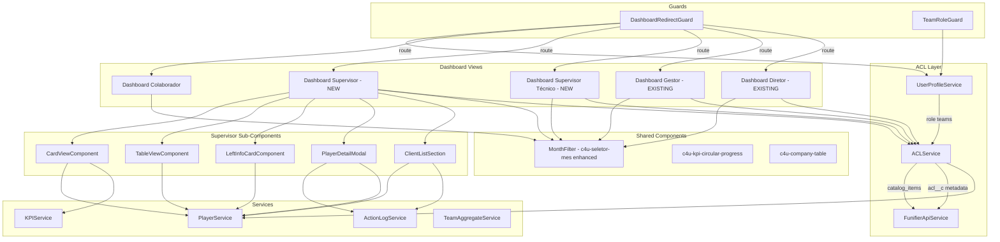

# Design Document: ACL Dashboard Refactor

## Overview

This design covers the refactoring of the ACL (Access Control List) system from team-based permissions to Virtual Goods-based permissions, and the creation/redesign of dashboards for five user profiles: JOGADOR, SUPERVISOR, SUPERVISOR_TECNICO, GESTOR, and DIRETOR.

Key changes:

1. **ACL System**: Replace team-membership-based data visibility with Virtual Goods from Funifier's catalog. Each operational team has a corresponding Virtual Good with identical IDs (Zero-Mapping). Access is determined by `catalog_items[vg_id].quantity > 0` on the player status.
2. **Role Determination**: Keep Role Teams for profile assignment (DIRETOR > GESTOR > SUPERVISOR > SUPERVISOR_TECNICO > JOGADOR priority), add new SUPERVISOR_TECNICO role via team `Fn2lrg3`.
3. **SUPERVISOR Dashboard**: New primary dashboard with Card View (default) and Table View, left info card with `pontos_supervisor`/`extra.cnpj_sup`/`extra.entrega_sup`, Player Detail Modal (CNPJ tab + Actions tab), client list from `cnpj_resp`, and button to legacy management dashboard.
4. **SUPERVISOR TÉCNICO**: Main view is Dashboard_Colaborador with navigation button to a read-only secondary dashboard (GESTOR-style without goal inputs).
5. **Month Filter**: Add "Toda temporada" option to the existing `c4u-seletor-mes` component for all profiles.
6. **Points Differentiation**: SUPERVISOR reads `pontos_supervisor`, others read `points`. No `locked_points` on any dashboard. All profiles read `coins`.

The application is an Angular 16.2.16 gamification dashboard using the Funifier API (`https://service2.funifier.com`).

## Architecture



### Change Impact Summary

| Area | Files Affected | Change Type |
|------|---------------|-------------|
| UserProfile enum | `src/app/utils/user-profile.ts` | Add SUPERVISOR_TECNICO, add Fn2lrg3 team ID |
| ACL Service | New `src/app/services/acl.service.ts` | New service for Virtual Good-based ACL |
| UserProfileService | `src/app/services/user-profile.service.ts` | Add SUPERVISOR_TECNICO methods, integrate ACL |
| Dashboard Redirect Guard | `src/app/guards/dashboard-redirect.guard.ts` | Add SUPERVISOR_TECNICO routing logic |
| Team Role Guard | `src/app/guards/team-role.guard.ts` | Update for SUPERVISOR_TECNICO |
| Routing | `src/app/pages/pages.routing.ts` | Add supervisor and supervisor-tecnico routes |
| Month Filter | `src/app/components/c4u-seletor-mes/` | Add "Toda temporada" option |
| Supervisor Dashboard | New `src/app/pages/dashboard/dashboard-supervisor/` | New component with Card/Table views |
| Supervisor Técnico Dashboard | New `src/app/pages/dashboard/dashboard-supervisor-tecnico/` | New read-only management dashboard |
| Player Detail Modal | New `src/app/modals/modal-player-detail/` | New modal with CNPJ + Actions tabs |
| Points Display | `src/app/services/player-mapper.service.ts`, KPI components | Read `pontos_supervisor` for SUPERVISOR |
| Existing Dashboards | `team-management-dashboard`, `dashboard-gestor` | Integrate Virtual Good ACL for team visibility |

## Components and Interfaces

### 1. ACL Service (New)

**File:** `src/app/services/acl.service.ts`

Centralized service for Virtual Good-based access control.

```typescript
@Injectable({ providedIn: 'root' })
export class ACLService {
  private readonly CACHE_DURATION = 5 * 60 * 1000; // 5 minutes
  private aclCache: { data: ACLResult; timestamp: number } | null = null;
  private metadataCache: ACLMetadataEntry[] | null = null;

  constructor(
    private funifierApi: FunifierApiService,
    private sessao: SessaoProvider
  ) {}

  /** Fetch catalog_items from player status and determine accessible team IDs */
  getAccessibleTeams(playerId: string): Observable<string[]> { ... }

  /** Check if player has access to a specific team via Virtual Good */
  hasTeamAccess(playerId: string, teamId: string): Observable<boolean> { ... }

  /** Fetch ACL metadata from acl__c collection */
  getACLMetadata(): Observable<ACLMetadataEntry[]> { ... }

  /** Get human-readable team name from metadata */
  getTeamDisplayName(teamId: string): Observable<string> { ... }

  /** Clear ACL cache */
  clearCache(): void { ... }
}
```

**Key behaviors:**
- Calls `GET /v3/player/:id/status` and inspects `catalog_items`
- `quantity > 0` = access granted; `quantity <= 0` or absent = no access
- IDs are case-sensitive
- Zero-Mapping: team `_id` = virtual good `_id` (no conversion)
- Results cached for 5 minutes
- Falls back to raw IDs if `acl__c` metadata fetch fails

### 2. UserProfile Enum Update

**File:** `src/app/utils/user-profile.ts`

```typescript
export enum UserProfile {
  JOGADOR = 'JOGADOR',
  SUPERVISOR = 'SUPERVISOR',
  SUPERVISOR_TECNICO = 'SUPERVISOR_TECNICO',
  GESTOR = 'GESTOR',
  DIRETOR = 'DIRETOR'
}

export const MANAGEMENT_TEAM_IDS = {
  GESTAO: 'FkmdnFU',
  SUPERVISAO: 'Fkmdmko',
  DIRECAO: 'FkmdhZ9',
  SUPERVISAO_TECNICA: 'Fn2lrg3'
} as const;
```

**Priority order** (highest to lowest): DIRETOR > GESTOR > SUPERVISOR > SUPERVISOR_TECNICO > JOGADOR

The `determineUserProfile()` function adds a check for `Fn2lrg3` after SUPERVISOR check.

### 3. UserProfileService Update

**File:** `src/app/services/user-profile.service.ts`

Add methods:
- `isSupervisorTecnico(): boolean`
- `canAccessSecondaryDashboard(): boolean` — true for SUPERVISOR_TECNICO
- Update `canAccessTeamManagement()` to include SUPERVISOR_TECNICO
- `getAccessibleTeamsByVirtualGoods(playerId: string): Observable<string[]>` — delegates to ACLService

### 4. Dashboard Redirect Guard Update

**File:** `src/app/guards/dashboard-redirect.guard.ts`

Updated routing logic:
- JOGADOR → `/dashboard` (Dashboard_Colaborador)
- SUPERVISOR → `/dashboard/supervisor` (new Dashboard_Supervisor)
- SUPERVISOR_TECNICO → `/dashboard` (Dashboard_Colaborador, with button to secondary)
- GESTOR → `/dashboard/team-management` (existing)
- DIRETOR → `/dashboard/team-management` (existing)
- Unauthenticated → `/login`
- JOGADOR accessing management URLs → redirect to `/dashboard`

### 5. Routing Update

**File:** `src/app/pages/pages.routing.ts`

```typescript
export const PagesRoutes: Routes = [
  {
    path: '',
    loadChildren: () => import('./dashboard/gamification-dashboard/gamification-dashboard.module')
      .then(m => m.GamificationDashboardModule),
    canActivate: [DashboardRedirectGuard]
  },
  {
    path: 'team-management',
    loadChildren: () => import('./dashboard/team-management-dashboard/team-management-dashboard.module')
      .then(m => m.TeamManagementDashboardModule),
    canActivate: [TeamRoleGuard]
  },
  {
    path: 'supervisor',
    loadChildren: () => import('./dashboard/dashboard-supervisor/dashboard-supervisor.module')
      .then(m => m.DashboardSupervisorModule),
    canActivate: [SupervisorGuard]
  },
  {
    path: 'supervisor-tecnico',
    loadChildren: () => import('./dashboard/dashboard-supervisor-tecnico/dashboard-supervisor-tecnico.module')
      .then(m => m.DashboardSupervisorTecnicoModule),
    canActivate: [SupervisorTecnicoGuard]
  },
  // ... existing routes
];
```

### 6. Dashboard Supervisor (New)

**File:** `src/app/pages/dashboard/dashboard-supervisor/`

Main dashboard for SUPERVISOR profile with:

**Layout:**
- Top: Month Filter (`c4u-seletor-mes` enhanced with "Toda temporada")
- Left: Info Card (SUPERVISOR's own metrics)
- Center: Toggle between Card View / Table View
- Bottom: Client List Section (SUPERVISOR's own `cnpj_resp`)
- Navigation: Button to legacy management dashboard (`/dashboard/team-management`)

**Card View Component** (`card-view.component.ts`):
- Displays one card per player from all accessible teams (via Virtual Good ACL)
- Deduplicates players across teams (show once with all teams listed)
- Each card shows: player name, metrics, goals, teams, points
- Click opens Player Detail Modal

**Table View Component** (`table-view.component.ts`):
- Tabular layout: player name, metrics, goals, points columns
- Click row opens Player Detail Modal
- Same data source and Month Filter as Card View
- Switching views preserves filter state and loaded data

**Left Info Card Component** (`left-info-card.component.ts`):
- Shows SUPERVISOR's own data from Player_Status_API
- Points from `pontos_supervisor` field (not `points`)
- Coins from `coins` field
- CNPJ metric from `extra.cnpj_sup` (not `extra.cnpj`)
- Entrega metric from `extra.entrega_sup` (not `extra.entrega`)
- Filtered by Month Filter

### 7. Player Detail Modal (New)

**File:** `src/app/modals/modal-player-detail/`

Two-tab modal opened from Card View or Table View:

**Tab 1 — CNPJ Tab:**
- Player summary data
- Table of all CNPJs from `cnpj_resp` with per-CNPJ metrics
- Click CNPJ row → opens existing company detail modal (`modal-company-detail`)
- Filtered by Month Filter

**Tab 2 — Actions Tab:**
- Lists all actions from `action_log` for the player
- Columns: action name (`attributes.acao`), company (cross-ref `attributes.cnpj` with `empid_cnpj__c`), metrics, date, points (achievements)
- Filtered by Month Filter

### 8. Dashboard Supervisor Técnico (New)

**File:** `src/app/pages/dashboard/dashboard-supervisor-tecnico/`

Read-only management dashboard similar to GESTOR/DIRETOR:
- Team KPIs, player lists, performance data for Virtual Good-accessible teams
- NO metric goal input fields (`cnpj_goal`, `entrega_goal`)
- Button to return to Dashboard_Colaborador
- Month Filter with "Toda temporada"
- Reuses existing team management dashboard components where possible, with goal inputs hidden

**Design Decision:** Implement as a wrapper around the existing `team-management-dashboard` component with a `readOnly` input flag that hides goal-setting controls, rather than duplicating the entire component.

### 9. Month Filter Enhancement

**File:** `src/app/components/c4u-seletor-mes/`

Changes to `c4u-seletor-mes`:
- Add "Toda temporada" option as the last item in the months array
- When selected, emit `null` (or a special sentinel value like `-1`) to indicate no month filtering
- All dashboard components interpret `null`/`-1` as "use season-wide date range"
- Default selection remains current month
- Available on all dashboard views (Colaborador, Supervisor, Supervisor Técnico, Gestor, Diretor)

### 10. Existing Dashboard Integration

**Dashboard Gestor & Dashboard Diretor:**
- Replace team-membership-based visibility with Virtual Good ACL
- In `loadAvailableTeams()`, call `ACLService.getAccessibleTeams()` instead of reading from `user.teams`
- DIRETOR: if no Virtual Goods found, fall back to showing all teams (backward compatibility)

**Dashboard Colaborador:**
- Add navigation button for SUPERVISOR_TECNICO to access secondary dashboard
- Conditionally render button based on `UserProfileService.isSupervisorTecnico()`

### 11. Points Field Differentiation

**Affected files:** `player-mapper.service.ts`, `left-info-card.component.ts`, KPI display components

| Profile | Points Field | Coins Field | CNPJ Metric | Entrega Metric |
|---------|-------------|-------------|-------------|----------------|
| SUPERVISOR | `pontos_supervisor` | `coins` | `extra.cnpj_sup` | `extra.entrega_sup` |
| JOGADOR | `points` | `coins` | `extra.cnpj` | `extra.entrega` |
| GESTOR | `points` | `coins` | `extra.cnpj` | `extra.entrega` |
| DIRETOR | `points` | `coins` | `extra.cnpj` | `extra.entrega` |
| SUPERVISOR_TECNICO | `points` | `coins` | `extra.cnpj` | `extra.entrega` |

No `locked_points` displayed on any dashboard for any profile.

### 12. SUPERVISOR Metrics Calculation

The Dashboard_Supervisor calculates the SUPERVISOR's aggregate metrics as the arithmetic mean of all players' metrics across accessible teams:
- Points average = sum(player.points) / count(players with data)
- KPI average = sum(player.kpi_value) / count(players with data)
- Teams with zero players for the selected period are excluded from averages (avoid division by zero)
- Month Filter constrains which data is included in averages

## Data Models

### ACL Models (New)

```typescript
/** Result of ACL verification for a player */
interface ACLResult {
  playerId: string;
  accessibleTeamIds: string[];  // team IDs where quantity > 0
  catalogItems: Record<string, { quantity: number; item: string }>;
  timestamp: number;
}

/** Entry from acl__c custom collection */
interface ACLMetadataEntry {
  team_name: string;
  team_id: string;
  virtual_good_name: string;
  virtual_good_id: string;
}
```

### Player Status Extensions

```typescript
/** Extended PlayerExtra for SUPERVISOR-specific fields */
interface PlayerExtra {
  // Existing fields
  entrega_goal?: number;
  cnpj_goal?: number;
  cnpj_resp?: string;
  entrega?: string;
  // New SUPERVISOR-specific fields
  cnpj_sup?: string;       // SUPERVISOR's own CNPJ metric
  entrega_sup?: string;    // SUPERVISOR's own entrega metric
  [key: string]: any;
}
```

### Supervisor Dashboard Models (New)

```typescript
/** Player card data for Card View / Table View */
interface SupervisorPlayerCard {
  playerId: string;
  playerName: string;
  teams: string[];           // team names the player belongs to
  teamIds: string[];         // team IDs
  points: number;
  coins: number;
  kpis: KPIData[];
  cnpjCount: number;
  entregaPercentage: number;
}

/** Left info card data for SUPERVISOR */
interface SupervisorInfoCard {
  name: string;
  points: number;            // from pontos_supervisor
  coins: number;             // from coins
  cnpjMetric: number;        // from extra.cnpj_sup
  entregaMetric: number;     // from extra.entrega_sup
  kpis: KPIData[];
  goals: GoalMetric[];
}

/** Player detail modal data */
interface PlayerDetailData {
  playerId: string;
  playerName: string;
  cnpjList: PlayerCnpjEntry[];
  actions: PlayerActionEntry[];
}

interface PlayerCnpjEntry {
  cnpj: string;
  companyName: string;
  actionCount: number;
  kpis: KPIData[];
}

interface PlayerActionEntry {
  actionName: string;       // attributes.acao
  companyCnpj: string;     // attributes.cnpj
  companyName: string;      // from empid_cnpj__c cross-reference
  metrics: Record<string, number>;
  date: Date;
  points: number;           // from achievements
}

/** View toggle state */
type SupervisorViewMode = 'card' | 'table';
```

### Month Filter Model Update

```typescript
/** Month filter emission */
interface MonthFilterEvent {
  monthsAgo: number;        // 0 = current month, -1 = "Toda temporada"
  dateRange: {
    start: Date;
    end: Date;
  } | null;                 // null = no filtering (whole season)
}
```

### Role Teams Reference

| Role | Team ID | Enum Key | Priority |
|------|---------|----------|----------|
| Diretor | FkmdhZ9 | DIRECAO | 1 (highest) |
| Gestor | FkmdnFU | GESTAO | 2 |
| Supervisor | Fkmdmko | SUPERVISAO | 3 |
| Supervisor Técnico | Fn2lrg3 | SUPERVISAO_TECNICA | 4 |
| Jogador | (none) | — | 5 (lowest) |


## Correctness Properties

*A property is a characteristic or behavior that should hold true across all valid executions of a system — essentially, a formal statement about what the system should do. Properties serve as the bridge between human-readable specifications and machine-verifiable correctness guarantees.*

### Property 1: Virtual Good access determination

*For any* `catalog_items` object and any Virtual Good ID, the ACL service should grant access if and only if the entry exists in `catalog_items` and its `quantity` is strictly greater than 0. If the entry is absent, has `quantity <= 0`, or if `catalog_items` is missing/malformed, access should be denied. Lookups must be case-sensitive (e.g., "ABC123" and "abc123" are distinct IDs).

**Validates: Requirements 1.2, 1.3, 1.4, 1.5, 15.2**

### Property 2: Role priority determination

*For any* teams array containing any combination of Role Team IDs (FkmdhZ9, FkmdnFU, Fkmdmko, Fn2lrg3), the `determineUserProfile` function should return the highest-priority role present: DIRETOR (FkmdhZ9) > GESTOR (FkmdnFU) > SUPERVISOR (Fkmdmko) > SUPERVISOR_TECNICO (Fn2lrg3) > JOGADOR (no role teams). If the array is empty, null, or undefined, the result should be JOGADOR.

**Validates: Requirements 2.2, 2.3, 2.4, 2.5, 2.6**

### Property 3: ACL metadata provides display names

*For any* ACL metadata entry from the `acl__c` collection, when resolving a team display name for a given `team_id`, the service should return the `team_name` field from the matching metadata entry. If no matching entry exists, the raw `team_id` should be returned as fallback.

**Validates: Requirements 3.2**

### Property 4: Player filtering by accessible teams

*For any* set of players with team assignments and any set of accessible team IDs (from Virtual Good ACL), the dashboard should display exactly those players who belong to at least one accessible team. Players not belonging to any accessible team should be excluded.

**Validates: Requirements 4.4, 7.2**

### Property 5: Player deduplication across teams

*For any* set of players where a player belongs to multiple teams visible to the SUPERVISOR, the Card View should contain exactly one entry per unique player ID, and that entry's teams list should contain all teams the player belongs to from the accessible set.

**Validates: Requirements 7.3**

### Property 6: Month filter date range emission

*For any* month selection (represented as months-ago offset), the Month Filter should emit a date range covering exactly the first millisecond to the last millisecond of that calendar month. When "Toda temporada" is selected, the emitted value should be null (indicating no month filtering / season-wide range).

**Validates: Requirements 13.2, 13.3**

### Property 7: Month filter constrains dashboard data

*For any* selected month and any set of data entries (action logs, metrics) spanning multiple months, the filtered result should contain only entries whose timestamp falls within the selected month's start and end dates. When "Toda temporada" is selected, all entries within the season should be included.

**Validates: Requirements 7.5, 7.6**

### Property 8: Card View and Table View data consistency

*For any* player data set and Month Filter selection, the set of player records displayed in Card View should be identical to the set displayed in Table View (same player IDs, same metric values, same points).

**Validates: Requirements 8.4**

### Property 9: Profile-based field mapping for points and metrics

*For any* player object and UserProfile, the system should read points from `pontos_supervisor` when the profile is SUPERVISOR, and from `points` for all other profiles (JOGADOR, GESTOR, DIRETOR, SUPERVISOR_TECNICO). For SUPERVISOR, CNPJ metric should come from `extra.cnpj_sup` and entrega metric from `extra.entrega_sup`. Coins should always come from the `coins` field regardless of profile.

**Validates: Requirements 10.1, 10.5, 16.1, 16.2, 16.3**

### Property 10: No locked points display

*For any* UserProfile and any player object, the dashboard point wallet output should never include or display `locked_points` / "pontos bloqueados". The point wallet should only contain unlocked points and coins.

**Validates: Requirements 16.4**

### Property 11: SUPERVISOR aggregate metrics as arithmetic mean

*For any* non-empty set of players across the SUPERVISOR's accessible teams, the SUPERVISOR's aggregate points should equal the arithmetic mean of all players' points, and each aggregate KPI should equal the arithmetic mean of all players' values for that KPI. Teams with zero players for the selected period should be excluded from the calculation (no division by zero).

**Validates: Requirements 12.1, 12.2, 12.3**

### Property 12: Dashboard routing by profile

*For any* authenticated user with a determined UserProfile, the dashboard redirect guard should route to: `/dashboard` for JOGADOR, `/dashboard/supervisor` for SUPERVISOR, `/dashboard` for SUPERVISOR_TECNICO, `/dashboard/team-management` for GESTOR, and `/dashboard/team-management` for DIRETOR.

**Validates: Requirements 14.1, 14.2, 14.3, 14.4, 14.5**

### Property 13: ACL cache TTL

*For any* successful ACL verification result, the cached result should be returned for subsequent calls within 5 minutes without making a new API call. After 5 minutes have elapsed, a new API call should be made.

**Validates: Requirements 15.5**

### Property 14: Player detail modal CNPJ data completeness

*For any* player with a `cnpj_resp` field, the Player Detail Modal's CNPJ tab should display one row per CNPJ from `cnpj_resp`, and each row should include the CNPJ identifier, company name (from `empid_cnpj__c` cross-reference), and per-CNPJ metrics.

**Validates: Requirements 9.2**

### Property 15: Player detail modal actions data completeness

*For any* action log entry for a player, the Player Detail Modal's Actions tab should display a row containing: action name (from `attributes.acao`), company name (cross-referencing `attributes.cnpj` with `empid_cnpj__c`), date, and points (from achievements).

**Validates: Requirements 9.4**

### Property 16: Client list sourced from cnpj_resp with cross-reference

*For any* SUPERVISOR player object with a `cnpj_resp` field, the client list section should display exactly the CNPJs parsed from `cnpj_resp`, and each entry should be cross-referenced with `empid_cnpj__c` to resolve company names and individual metrics.

**Validates: Requirements 17.1, 17.3**

## Error Handling

### ACL Verification Errors

- **Player Status API failure** (Req 15.1): If `GET /v3/player/:id/status` fails, the ACL service logs the error and returns an empty accessible teams list. The dashboard redirect guard treats this as JOGADOR-level access, redirecting to the regular player dashboard.
- **Missing/malformed catalog_items** (Req 15.2): If `catalog_items` is null, undefined, not an object, or missing expected structure, the ACL service treats the user as having no Virtual Good access and logs a warning.
- **ACL metadata failure** (Req 3.4, 15.3): If the `acl__c` collection query fails, the ACL service continues operating with raw team IDs as display names and logs the error. The UI shows raw IDs instead of human-readable names.
- **User notification** (Req 15.4): When ACL verification fails, a toast notification is displayed: "Não foi possível carregar dados de permissão. Exibindo dashboard padrão."

### Dashboard Data Errors

- **Team member data failure**: If loading team members for a Virtual Good-accessible team fails, that team is skipped and an error is logged. Other teams continue loading.
- **Player detail modal errors**: If action log or CNPJ data fails to load, the modal shows an empty state with a retry button per tab.
- **Month filter errors**: If season dates cannot be loaded, the month filter defaults to showing only the current month without "Toda temporada".

### Caching Strategy

- ACL results: 5-minute TTL cache. On cache miss or expiry, a new API call is made. On API failure, stale cache is NOT used (fail-safe: deny access).
- Player data: Existing 3-minute cache in `PlayerService` remains unchanged.
- ACL metadata: Cached indefinitely per session (metadata rarely changes). Cleared on logout.

### Validation

- Virtual Good IDs: Case-sensitive string comparison. No trimming or normalization.
- Role Team IDs: Exact match against known constants (FkmdhZ9, FkmdnFU, Fkmdmko, Fn2lrg3).
- Month filter: Validates that selected month falls within season date range.

## Testing Strategy

### Unit Tests

Unit tests cover specific examples, edge cases, and integration points:

- **ACL Service**: Verify that a player with `catalog_items: { "ABC": { quantity: 1 } }` gets access to team "ABC". Verify that `quantity: 0` denies access. Verify case-sensitivity. Verify behavior with missing `catalog_items`.
- **Role Determination**: Verify SUPERVISOR_TECNICO assignment for user with only Fn2lrg3. Verify priority when user has both Fkmdmko and Fn2lrg3 (should be SUPERVISOR). Verify JOGADOR for empty teams.
- **Dashboard Routing**: Verify redirect guard sends SUPERVISOR to `/dashboard/supervisor`. Verify JOGADOR accessing `/dashboard/team-management` is redirected. Verify unauthenticated user goes to `/login`.
- **Month Filter**: Verify "Toda temporada" emits null. Verify default is current month. Verify date range boundaries.
- **Supervisor Dashboard**: Verify Card View is default. Verify view toggle preserves filter state. Verify left info card reads `pontos_supervisor`.
- **Supervisor Técnico**: Verify read-only mode hides goal inputs. Verify navigation button to secondary dashboard.
- **Player Detail Modal**: Verify CNPJ tab shows data from `cnpj_resp`. Verify Actions tab columns.
- **Points Differentiation**: Verify SUPERVISOR reads `pontos_supervisor`. Verify others read `points`. Verify no `locked_points` in output.

### Property-Based Tests

Property-based tests use the `fast-check` library. Each test runs a minimum of 100 iterations.

Each property test must be tagged with a comment referencing the design property:
```
// Feature: acl-dashboard-refactor, Property {number}: {property_text}
```

**Property tests to implement:**

1. **Virtual Good access determination** (Property 1): Generate random `catalog_items` objects with random quantities (positive, zero, negative) and random Virtual Good IDs. Verify access = (exists AND quantity > 0). Include case-sensitivity edge cases.
2. **Role priority determination** (Property 2): Generate random teams arrays containing subsets of Role Team IDs. Verify the returned profile matches the highest-priority role present.
3. **ACL metadata display names** (Property 3): Generate random metadata entries and team IDs. Verify display name resolution uses `team_name` when available, raw ID otherwise.
4. **Player filtering by accessible teams** (Property 4): Generate random player sets with team assignments and random accessible team ID sets. Verify output contains exactly players in accessible teams.
5. **Player deduplication** (Property 5): Generate random players assigned to multiple teams. Verify unique player IDs in output with merged team lists.
6. **Month filter date range** (Property 6): Generate random month offsets. Verify emitted date range covers exactly that calendar month.
7. **Month filter data constraint** (Property 7): Generate random data entries with timestamps across months and a random month selection. Verify filtered output contains only entries within the selected month.
8. **Card/Table View consistency** (Property 8): Generate random player data sets. Verify Card View and Table View produce identical player record sets.
9. **Profile field mapping** (Property 9): Generate random player objects with both `pontos_supervisor` and `points` fields, and random UserProfile values. Verify correct field is read per profile.
10. **No locked points** (Property 10): Generate random player objects with `locked_points` values. Verify the point wallet output never includes locked_points.
11. **SUPERVISOR aggregate mean** (Property 11): Generate random sets of players with random point/KPI values. Verify aggregate equals arithmetic mean, with zero-player teams excluded.
12. **Dashboard routing** (Property 12): Generate random UserProfile values. Verify the correct route path is returned for each.
13. **ACL cache TTL** (Property 13): Generate random timestamps and verify cache hit/miss behavior relative to 5-minute window.
14. **Player detail CNPJ data** (Property 14): Generate random `cnpj_resp` strings and `empid_cnpj__c` data. Verify modal data contains one row per CNPJ with resolved company names.
15. **Player detail actions data** (Property 15): Generate random action log entries. Verify each rendered row contains action name, company, date, and points.
16. **Client list from cnpj_resp** (Property 16): Generate random `cnpj_resp` strings and cross-reference data. Verify client list matches parsed CNPJs with resolved names.

### Test Configuration

- Library: `fast-check` (already available in the project)
- Minimum iterations: 100 per property
- Test runner: Karma (existing project configuration)
- Each correctness property is implemented by a single property-based test
- Each property test references its design document property via comment tag
