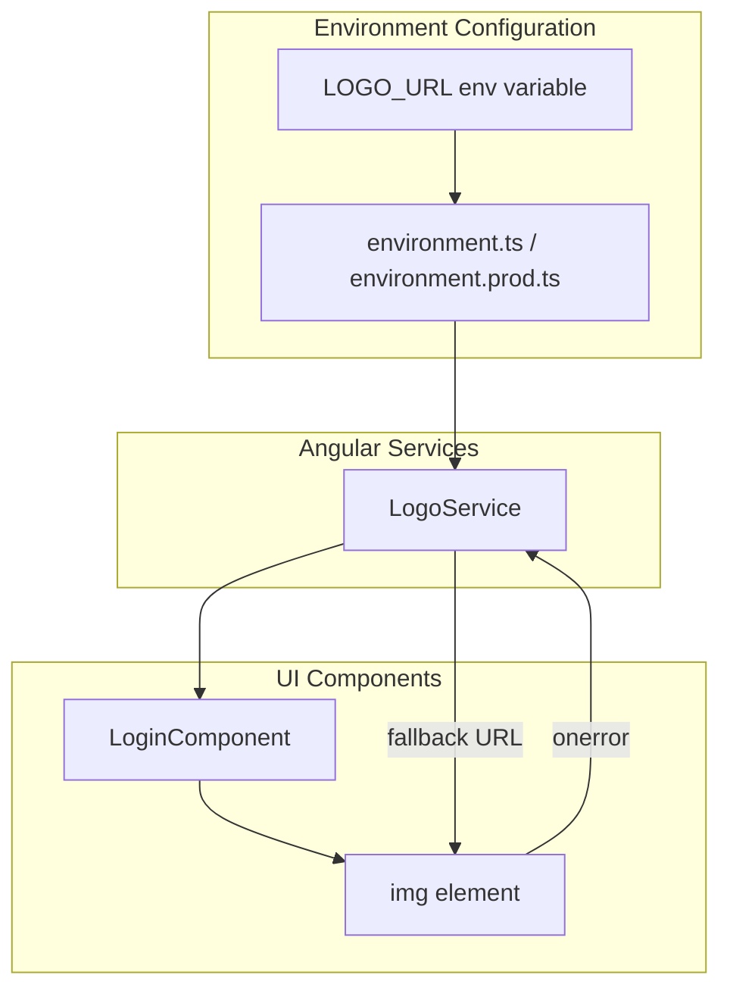

# Design Document: Configurable Logo

## Overview

This design document describes the implementation of a configurable logo feature for the Angular application. The feature enables system administrators to customize the application logo via the `LOGO_URL` environment variable, while maintaining backward compatibility with the existing default logo.

The implementation follows Angular best practices with a centralized `LogoService` that handles logo URL resolution, caching, and fallback logic. The login page will be updated to consume this service instead of using a hardcoded logo path.

### Key Design Decisions

1. **Centralized Service Pattern**: A dedicated `LogoService` will encapsulate all logo resolution logic, ensuring consistency across the application and enabling future extensibility.

2. **Environment-Based Configuration**: The logo URL will be read from the Angular environment configuration at build time, following the existing pattern used for Funifier API configuration.

3. **Graceful Degradation**: The system will fall back to the default logo when the custom logo fails to load, ensuring the UI never displays a broken image.

4. **Immutable Configuration**: The logo URL is resolved once at service initialization and cached, avoiding repeated environment lookups.

## Architecture



### Data Flow

1. At application build time, the `LOGO_URL` environment variable is embedded into the environment configuration
2. `LogoService` reads the configuration at initialization and caches the resolved logo URL
3. `LoginComponent` injects `LogoService` and retrieves the logo URL
4. The template binds the logo URL to an `` element
5. If the image fails to load, the `onerror` handler triggers fallback to the default logo

## Components and Interfaces

### LogoService

```typescript
@Injectable({ providedIn: 'root' })
export class LogoService {
  private readonly DEFAULT_LOGO_URL = '/assets/images/logo-bwa-white-inteira-full.png';
  private resolvedLogoUrl: string;

  constructor() {
    this.resolvedLogoUrl = this.resolveLogoUrl();
  }

  /**
   * Returns the resolved logo URL.
   * Returns the custom logo URL if configured, otherwise the default logo.
   */
  getLogoUrl(): string {
    return this.resolvedLogoUrl;
  }

  /**
   * Returns the default logo URL for fallback scenarios.
   */
  getDefaultLogoUrl(): string {
    return this.DEFAULT_LOGO_URL;
  }

  /**
   * Validates if a URL is a valid format for a logo.
   */
  isValidLogoUrl(url: string | undefined | null): boolean {
    if (!url || typeof url !== 'string') {
      return false;
    }
    const trimmed = url.trim();
    if (trimmed === '') {
      return false;
    }
    // Accept relative paths starting with / or valid absolute URLs
    if (trimmed.startsWith('/')) {
      return true;
    }
    try {
      new URL(trimmed);
      return true;
    } catch {
      return false;
    }
  }

  private resolveLogoUrl(): string {
    const configuredUrl = environment.logoUrl;
    return this.isValidLogoUrl(configuredUrl) ? configuredUrl!.trim() : this.DEFAULT_LOGO_URL;
  }
}
```

### LoginComponent Updates

The `LoginComponent` will be updated to:
1. Inject `LogoService`
2. Use a property to hold the current logo URL
3. Implement an error handler for image load failures

```typescript
// New properties
bwaLogoUrl: string;

// In constructor
constructor(
  // ... existing dependencies
  private logoService: LogoService
) {
  this.bwaLogoUrl = this.logoService.getLogoUrl();
}

// New method for error handling
onLogoError(): void {
  this.bwaLogoUrl = this.logoService.getDefaultLogoUrl();
}
```

### Template Updates

```html

```

### Environment Configuration Interface

```typescript
// Addition to environment interface
export interface Environment {
  // ... existing properties
  logoUrl?: string;
}

// In environment.prod.ts and environment.homol.ts
export const environment = {
  // ... existing properties
  logoUrl: process.env['LOGO_URL'] || process.env['logo_url'] || '',
};

// In environment.ts (development)
export const environment = {
  // ... existing properties
  logoUrl: '', // Empty string means use default logo
};
```

## Data Models

### Configuration Model

| Property | Type | Description |
|----------|------|-------------|
| `logoUrl` | `string \| undefined` | The custom logo URL from environment variable. Empty or undefined means use default. |

### LogoService State

| Property | Type | Description |
|----------|------|-------------|
| `DEFAULT_LOGO_URL` | `string` (readonly) | The default logo path: `/assets/images/logo-bwa-white-inteira-full.png` |
| `resolvedLogoUrl` | `string` | The cached resolved logo URL (either custom or default) |

### URL Validation Rules

A logo URL is considered valid if:
1. It is a non-empty string after trimming
2. It is either:
   - A relative path starting with `/` (e.g., `/assets/images/custom-logo.png`)
   - A valid absolute URL (e.g., `https://example.com/logo.png`)


## Correctness Properties

*A property is a characteristic or behavior that should hold true across all valid executions of a system—essentially, a formal statement about what the system should do. Properties serve as the bridge between human-readable specifications and machine-verifiable correctness guarantees.*

### Property 1: URL Resolution Correctness

*For any* logo URL configuration value, the `LogoService.getLogoUrl()` method should return:
- The configured URL (trimmed) if it is a valid, non-empty URL format
- The default logo URL (`/assets/images/logo-bwa-white-inteira-full.png`) if the configuration is empty, whitespace-only, undefined, null, or an invalid URL format

**Validates: Requirements 1.2, 1.3, 3.2**

### Property 2: Error Fallback Behavior

*For any* image load error event on the logo element, the `LoginComponent.onLogoError()` handler should set the logo URL to the default logo URL, ensuring the UI never displays a broken image.

**Validates: Requirements 3.1, 3.3**

### Property 3: Caching Consistency

*For any* sequence of calls to `LogoService.getLogoUrl()`, the method should always return the same value (the value resolved at service initialization), demonstrating that the logo URL is cached and not re-resolved on each call.

**Validates: Requirements 4.3**

### Property 4: URL Validation Completeness

*For any* string input to `LogoService.isValidLogoUrl()`:
- Relative paths starting with `/` should return `true`
- Valid absolute URLs (http://, https://) should return `true`
- Empty strings, whitespace-only strings, null, undefined, and malformed URLs should return `false`

**Validates: Requirements 1.2, 3.2**

## Error Handling

### Image Load Failure

When a custom logo image fails to load (network error, 404, invalid image format):

1. The `` element's `error` event fires
2. The `onLogoError()` handler is invoked
3. The component sets `bwaLogoUrl` to the default logo URL
4. Angular's change detection updates the template
5. The default logo is displayed

```typescript
onLogoError(): void {
  // Only fallback if not already using default to prevent infinite loops
  if (this.bwaLogoUrl !== this.logoService.getDefaultLogoUrl()) {
    this.bwaLogoUrl = this.logoService.getDefaultLogoUrl();
  }
}
```

### Invalid URL Configuration

When the `LOGO_URL` environment variable contains an invalid URL:

1. `LogoService` validates the URL during initialization
2. Invalid URLs are rejected (empty, whitespace, malformed)
3. The service falls back to the default logo URL
4. No error is thrown; the application continues normally

### Edge Cases

| Scenario | Behavior |
|----------|----------|
| `LOGO_URL` is empty string | Use default logo |
| `LOGO_URL` is whitespace only | Use default logo |
| `LOGO_URL` is undefined | Use default logo |
| `LOGO_URL` is relative path (`/assets/...`) | Use configured path |
| `LOGO_URL` is absolute URL (`https://...`) | Use configured URL |
| Custom logo returns 404 | Fall back to default logo |
| Custom logo is not an image | Fall back to default logo |
| Default logo fails to load | Display alt text (last resort) |

## Testing Strategy

### Unit Tests

Unit tests will verify specific examples and edge cases:

1. **LogoService Tests**
   - Service initializes with default logo when no URL configured
   - Service returns configured URL when valid URL is set
   - Service returns default for empty string configuration
   - Service returns default for whitespace-only configuration
   - `isValidLogoUrl()` returns true for valid relative paths
   - `isValidLogoUrl()` returns true for valid absolute URLs
   - `isValidLogoUrl()` returns false for empty/null/undefined
   - `isValidLogoUrl()` returns false for malformed URLs

2. **LoginComponent Tests**
   - Component initializes with logo URL from LogoService
   - `onLogoError()` sets logo URL to default
   - Template binds logo URL correctly
   - Error handler is attached to img element

### Property-Based Tests

Property-based tests will verify universal properties across many generated inputs. Each test will run a minimum of 100 iterations.

**Library**: fast-check (JavaScript property-based testing library)

1. **URL Resolution Property Test**
   - Generate random valid URLs (relative and absolute)
   - Verify service returns the configured URL
   - Generate random invalid inputs (empty, whitespace, malformed)
   - Verify service returns default logo
   - **Tag**: Feature: configurable-logo, Property 1: URL Resolution Correctness

2. **Caching Consistency Property Test**
   - Generate random number of sequential calls (1-100)
   - Verify all calls return identical value
   - **Tag**: Feature: configurable-logo, Property 3: Caching Consistency

3. **URL Validation Property Test**
   - Generate random strings
   - Verify validation correctly categorizes valid vs invalid URLs
   - **Tag**: Feature: configurable-logo, Property 4: URL Validation Completeness

### Integration Tests

1. **Login Page Integration**
   - Verify logo displays correctly with custom URL
   - Verify logo displays correctly with default URL
   - Verify fallback works when custom logo fails to load

### Test Configuration

```typescript
// Property test configuration
import * as fc from 'fast-check';

// Minimum 100 iterations per property test
const propertyTestConfig = { numRuns: 100 };

// Example property test structure
describe('LogoService Property Tests', () => {
  it('should resolve valid URLs correctly', () => {
    fc.assert(
      fc.property(
        fc.oneof(
          fc.webUrl(),
          fc.constant('/assets/images/test.png')
        ),
        (validUrl) => {
          // Test implementation
        }
      ),
      propertyTestConfig
    );
  });
});
```
