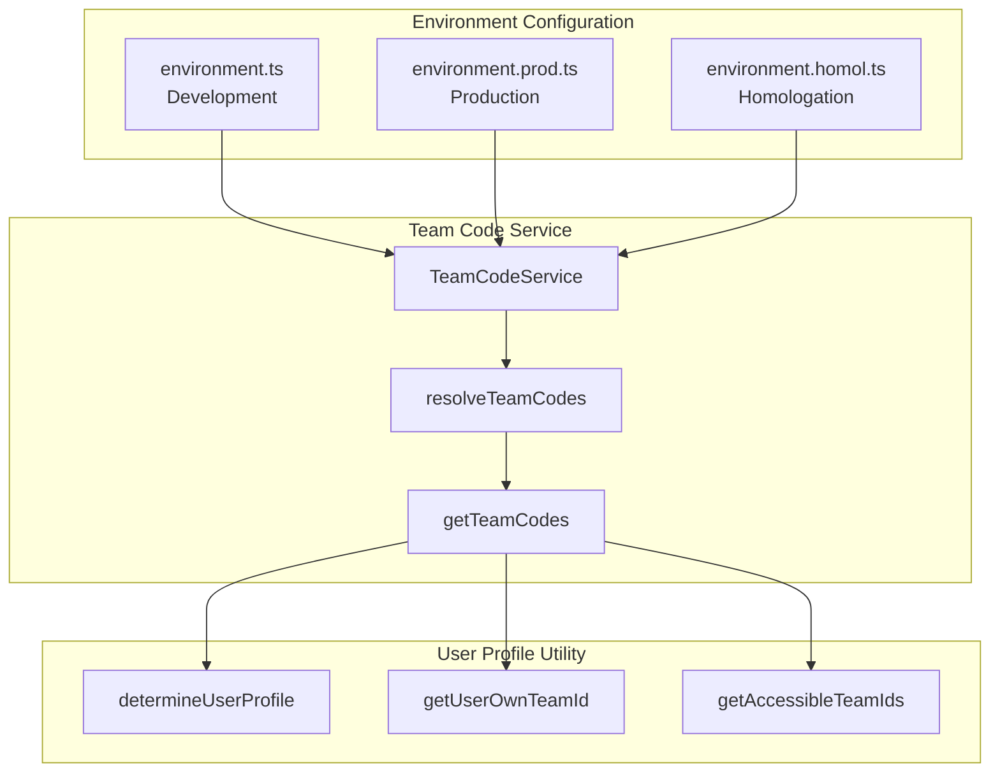
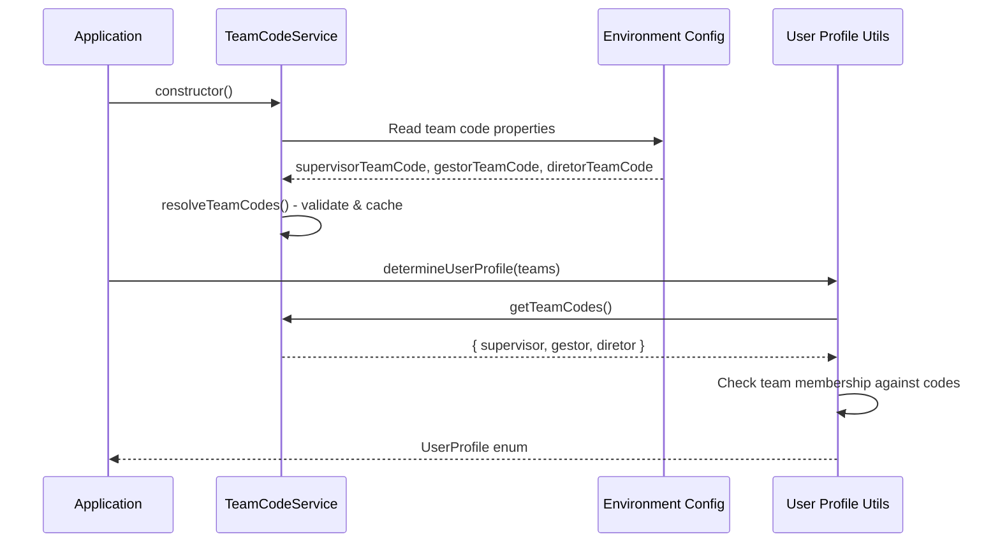

# Design Document: Configurable Team Codes

## Overview

This feature makes the team codes for Supervisor, Gestor, and Diretor roles configurable via environment variables instead of being hardcoded in the `user-profile.ts` utility. This follows the established pattern from the `LogoService` and `LOGO_URL` configuration, enabling different deployments to use different team codes without code changes.

The implementation involves:
1. Adding team code properties to all environment files
2. Creating a `TeamCodeService` to centralize team code resolution
3. Updating `user-profile.ts` to use the service instead of hardcoded constants

## Architecture



### Data Flow



## Components and Interfaces

### 1. Environment Configuration Interface

Each environment file will expose three new properties for team codes:

```typescript
interface EnvironmentConfig {
  // ... existing properties
  
  // Team Code Configuration
  supervisorTeamCode: string;  // Supervisão team code
  gestorTeamCode: string;      // Gestão team code
  diretorTeamCode: string;     // Direção/Admin team code
}
```

### 2. TeamCodeService

A new service following the `LogoService` pattern to centralize team code resolution:

```typescript
interface TeamCodes {
  supervisor: string;
  gestor: string;
  diretor: string;
}

@Injectable({ providedIn: 'root' })
class TeamCodeService {
  // Default values (current hardcoded values)
  private readonly DEFAULT_SUPERVISOR_CODE = 'Fkmdmko';
  private readonly DEFAULT_GESTOR_CODE = 'FkmdnFU';
  private readonly DEFAULT_DIRETOR_CODE = 'FkmdhZ9';
  
  // Cached resolved codes
  private resolvedCodes: TeamCodes;
  
  constructor() {
    this.resolvedCodes = this.resolveTeamCodes();
  }
  
  getTeamCodes(): TeamCodes;
  getSupervisorCode(): string;
  getGestorCode(): string;
  getDiretorCode(): string;
  isValidTeamCode(code: string | undefined | null): boolean;
  private resolveTeamCodes(): TeamCodes;
}
```

### 3. Updated User Profile Utility

The `user-profile.ts` functions will be updated to accept team codes as parameters or use the service:

```typescript
// Option A: Inject service (requires converting to class)
// Option B: Pass team codes as parameters (maintains functional approach)

// Chosen approach: Pass team codes as optional parameters with defaults from service
function determineUserProfile(
  teams: any[] | undefined | null,
  teamCodes?: TeamCodes
): UserProfile;

function getUserOwnTeamId(
  teams: any[] | undefined | null,
  profile: UserProfile,
  teamCodes?: TeamCodes
): string | null;

function getAccessibleTeamIds(
  teams: any[] | undefined | null,
  profile: UserProfile,
  teamCodes?: TeamCodes
): string[];
```

## Data Models

### TeamCodes Interface

```typescript
/**
 * Represents the configured team codes for management roles
 */
export interface TeamCodes {
  /** Team code for Supervisão role */
  supervisor: string;
  /** Team code for Gestão role */
  gestor: string;
  /** Team code for Direção/Admin role */
  diretor: string;
}
```

### Environment Configuration Updates

#### Development (environment.ts)
```typescript
export const environment = {
  // ... existing properties
  
  // Team Code Configuration (hardcoded defaults for development)
  supervisorTeamCode: 'Fkmdmko',
  gestorTeamCode: 'FkmdnFU',
  diretorTeamCode: 'FkmdhZ9'
};
```

#### Production (environment.prod.ts)
```typescript
export const environment = {
  // ... existing properties
  
  // Team Code Configuration (supports both uppercase and lowercase env vars)
  supervisorTeamCode: process.env['SUPERVISOR_TEAM_CODE'] || process.env['supervisor_team_code'] || 'Fkmdmko',
  gestorTeamCode: process.env['GESTOR_TEAM_CODE'] || process.env['gestor_team_code'] || 'FkmdnFU',
  diretorTeamCode: process.env['DIRETOR_TEAM_CODE'] || process.env['diretor_team_code'] || 'FkmdhZ9'
};
```

#### Homologation (environment.homol.ts)
```typescript
export const environment = {
  // ... existing properties
  
  // Team Code Configuration (supports both uppercase and lowercase env vars)
  supervisorTeamCode: process.env['SUPERVISOR_TEAM_CODE'] || process.env['supervisor_team_code'] || 'Fkmdmko',
  gestorTeamCode: process.env['GESTOR_TEAM_CODE'] || process.env['gestor_team_code'] || 'FkmdnFU',
  diretorTeamCode: process.env['DIRETOR_TEAM_CODE'] || process.env['diretor_team_code'] || 'FkmdhZ9'
};
```


## Correctness Properties

*A property is a characteristic or behavior that should hold true across all valid executions of a system—essentially, a formal statement about what the system should do. Properties serve as the bridge between human-readable specifications and machine-verifiable correctness guarantees.*

### Property 1: Default Values Consistency

*For any* TeamCodeService instance where environment variables are not set, the resolved team codes should equal the default values: supervisor='Fkmdmko', gestor='FkmdnFU', diretor='FkmdhZ9'.

**Validates: Requirements 2.1, 2.2, 2.3**

### Property 2: Profile Determination with Configured Codes

*For any* user teams array and any valid team code configuration, the `determineUserProfile` function should:
- Return DIRETOR if teams contain the configured `diretorTeamCode`
- Return GESTOR if teams contain the configured `gestorTeamCode` (and not diretor)
- Return SUPERVISOR if teams contain the configured `supervisorTeamCode` (and not diretor/gestor)
- Return JOGADOR if teams contain none of the configured management codes

**Validates: Requirements 3.1, 3.2, 3.3, 3.4**

### Property 3: Team Access Filtering with Configured Codes

*For any* user with a management profile (SUPERVISOR or GESTOR) and any valid team code configuration:
- For SUPERVISOR: `getAccessibleTeamIds` should return all user teams except the configured `supervisorTeamCode`
- For GESTOR: `getAccessibleTeamIds` should return all user teams except the configured `gestorTeamCode`

**Validates: Requirements 4.1, 4.2, 4.3**

### Property 4: Team Code Validation

*For any* string input to `isValidTeamCode`, the function should return true only for non-empty, non-whitespace strings.

**Validates: Requirements 1.1, 1.2, 1.3 (implicit validation)**

## Error Handling

### Invalid Team Code Values

The `TeamCodeService` will validate team codes and handle edge cases:

| Scenario | Behavior |
|----------|----------|
| Empty string in env var | Use default value |
| Whitespace-only string | Use default value |
| `undefined` or `null` | Use default value |
| Valid non-empty string | Use configured value |

### Validation Method

```typescript
isValidTeamCode(code: string | undefined | null): boolean {
  if (!code || typeof code !== 'string') {
    return false;
  }
  return code.trim().length > 0;
}
```

### Graceful Degradation

If any team code is invalid, the service falls back to the default value for that specific code, allowing partial configuration:

```typescript
private resolveTeamCodes(): TeamCodes {
  const envSupervisor = (environment as any).supervisorTeamCode;
  const envGestor = (environment as any).gestorTeamCode;
  const envDiretor = (environment as any).diretorTeamCode;
  
  return {
    supervisor: this.isValidTeamCode(envSupervisor) ? envSupervisor.trim() : this.DEFAULT_SUPERVISOR_CODE,
    gestor: this.isValidTeamCode(envGestor) ? envGestor.trim() : this.DEFAULT_GESTOR_CODE,
    diretor: this.isValidTeamCode(envDiretor) ? envDiretor.trim() : this.DEFAULT_DIRETOR_CODE
  };
}
```

## Testing Strategy

### Unit Tests

Unit tests will cover specific examples and edge cases:

1. **TeamCodeService Tests**
   - Service instantiation with default values
   - `getTeamCodes()` returns correct structure
   - `getSupervisorCode()`, `getGestorCode()`, `getDiretorCode()` return correct values
   - `isValidTeamCode()` edge cases: empty string, whitespace, null, undefined, valid strings

2. **User Profile Utility Tests**
   - `determineUserProfile()` with various team combinations
   - `getUserOwnTeamId()` for each profile type
   - `getAccessibleTeamIds()` filtering behavior

3. **Environment Configuration Tests**
   - Verify all environment files have team code properties
   - Verify default values match expected constants

### Property-Based Tests

Property-based tests will use **fast-check** library with minimum 100 iterations per test.

Each property test must be tagged with: **Feature: configurable-team-codes, Property {number}: {property_text}**

1. **Property 1 Test: Default Values**
   - Generate random environment states (with/without env vars)
   - Verify defaults are used when env vars are missing

2. **Property 2 Test: Profile Determination**
   - Generate random team arrays with various team code combinations
   - Generate random valid team code configurations
   - Verify profile determination follows priority rules

3. **Property 3 Test: Team Access Filtering**
   - Generate random team arrays for SUPERVISOR/GESTOR profiles
   - Generate random valid team code configurations
   - Verify management team codes are filtered from accessible teams

4. **Property 4 Test: Team Code Validation**
   - Generate random strings (including edge cases)
   - Verify validation correctly identifies valid/invalid codes

### Test Configuration

```typescript
// fast-check configuration
fc.configureGlobal({ numRuns: 100 });

// Example property test structure
describe('TeamCodeService Property Tests', () => {
  it('Property 2: Profile determination with configured codes', () => {
    // Feature: configurable-team-codes, Property 2: Profile Determination with Configured Codes
    fc.assert(
      fc.property(
        arbitraryTeamCodes(),
        arbitraryUserTeams(),
        (teamCodes, userTeams) => {
          // Test implementation
        }
      )
    );
  });
});
```

### Integration Tests

1. **End-to-end profile determination flow**
   - Mock environment with custom team codes
   - Verify user profile is correctly determined
   - Verify team access is correctly calculated

2. **Backward compatibility**
   - Verify existing functionality works with default values
   - Verify no breaking changes to existing consumers
