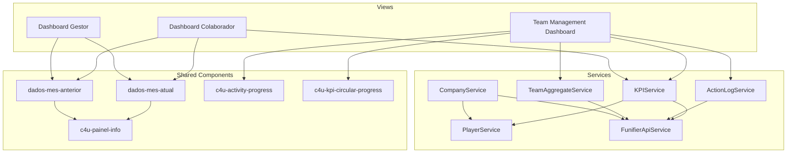

# Design Document: Dashboard Metrics Refactor

## Overview

This design covers the refactoring of dashboard metrics and cards across the application. The changes span six areas:

1. **Remove Processos cards** from all dashboard views (colaborador, gestor, team management)
2. **Migrate CNPJ data source** from `player.extra.cnpj` to `player.extra.cnpj_resp` for all player lookups
3. **Migrate all metrics and player lookups** to use `cnpj_resp` exclusively (while preserving `attributes.cnpj` in action_log queries)
4. **Goal setting** for SUPERVISOR/GESTOR via Funifier API using `extra.cnpj_goal` and `extra.entrega_goal`
5. **Feed dynamic goals** into existing `c4u-kpi-circular-progress` components
6. **Simplify activity count** in carteira table from distinct `delivery_id` to total action_log count

The application is an Angular gamification dashboard that uses the Funifier API (`https://service2.funifier.com`) for player data, action logs, and aggregate queries.

## Architecture

The current architecture follows a layered Angular pattern:



### Change Impact Summary

| Area | Files Affected | Change Type |
|------|---------------|-------------|
| Remove Processos | `dados-mes-atual`, `dados-mes-anterior`, `c4u-activity-progress` templates | Template removal |
| CNPJ Migration | `kpi.service.ts`, `company.service.ts`, `team-management-dashboard.component.ts` | Field rename (`extra.cnpj` → `extra.cnpj_resp`) |
| Goal Setting | `team-management-dashboard.component.ts`, `team-management-dashboard.component.html` | New form fields + API calls |
| Dynamic Goals | `kpi.service.ts`, `team-management-dashboard.component.ts` | Read `cnpj_goal`/`entrega_goal` instead of `client_goals`/hardcoded 90 |
| Activity Count | `action-log.service.ts`, `team-aggregate.service.ts`, template | Remove processCount query/projection |

## Components and Interfaces

### 1. Processos Card Removal

**Affected Components:**

- `src/app/pages/dashboard/dados-mes-atual/dados-mes-atual.component.ts` — Remove the `processInfo` array population in `defineDadosMesAtual()` and the `processInfo` panel from the template.
- `src/app/pages/dashboard/dados-mes-atual/dados-mes-atual.component.html` — Remove the second `<c4u-painel-info>` that renders `processInfo`.
- `src/app/pages/dashboard/dados-mes-anterior/dados-mes-anterior.component.ts` — Remove the `processInfo` array population in `defineDadosMesAnterior()` and the `processInfo` panel from the template.
- `src/app/pages/dashboard/dados-mes-anterior/dados-mes-anterior.component.html` — Remove the second `<c4u-painel-info>` that renders `processInfo`.
- `src/app/components/c4u-activity-progress/c4u-activity-progress.component.html` — Remove the entire "Processos" `<div class="section">` block.
- `src/app/components/c4u-activity-progress/c4u-activity-progress.component.ts` — The `processos` `@Input()` can remain for backward compatibility but will no longer be rendered.

**Design Decision:** We keep the `processInfo` property and `processos` input in TypeScript to avoid breaking any existing bindings. We only remove the template rendering. The modal `abreModal` in `dados-mes-atual` and `dados-mes-anterior` should also remove the `processInfo` types entry from `dataModal.types` so the modal no longer shows a "Processos" tab.

### 2. CNPJ Migration (`extra.cnpj` → `extra.cnpj_resp`)

**Affected Files:**

- `src/app/services/kpi.service.ts` — `getPlayerKPIs()` method reads `playerStatus.extra?.cnpj` in 3 places (main path, error path, fallback path). All must change to `playerStatus.extra?.cnpj_resp`.
- `src/app/services/company.service.ts` — `getCompanies()` reads `playerResponse?.extra?.companies`. This must change to `playerResponse?.extra?.cnpj_resp`.
- `src/app/pages/dashboard/team-management-dashboard/team-management-dashboard.component.ts` — Comments reference `extra.cnpj`; the `loadTeamKPIs()` method reads `extra.client_goals` from `player_status` aggregate. The `teamMembersData` comment references `extra.cnpj`.

**Design Decision:** The `action_log` queries that filter on `attributes.cnpj` remain unchanged — this is the action_log's own field, not a player field. Only player-level CNPJ lookups change.

**Parsing Logic:** The `cnpj_resp` field uses the same format as `cnpj` — a comma/semicolon-separated string. The existing split logic `split(/[;,]/).map(s => s.trim()).filter(s => s.length > 0)` applies unchanged.

### 3. Goal Setting (SUPERVISOR/GESTOR)

**Current State:** The team management dashboard sidebar has a "Configurar Meta de Clientes" form that saves to `extra.client_goals` via `updatePlayerClientesTarget()`. It only supports `cnpj_goal` (client count goal).

**New Design:** Expand the form to support both `cnpj_goal` and `entrega_goal`:

- `cnpj_goal`: Non-negative integer — target number of clients in portfolio
- `entrega_goal`: Number between 0 and 100 — target delivery on-time percentage

**API Integration:**
- Save `cnpj_goal`: `PUT https://service2.funifier.com/v3/player/{playerId}` with body `{"extra": {"cnpj_goal": value}}`
- Save `entrega_goal`: `PUT https://service2.funifier.com/v3/player/{playerId}` with body `{"extra": {"entrega_goal": value}}`

**Implementation in `team-management-dashboard.component.ts`:**
- Rename `metaConfig` to include both goals:
  ```typescript
  metaConfig: {
    selectedCollaborator: string;
    cnpjGoalValue: number | null;
    entregaGoalValue: number | null;
  }
  ```
- Rename `saveClientesMeta()` → `saveGoals()` and update to save both fields
- Rename `updatePlayerClientesTarget()` → `updatePlayerGoals()` to PUT both `cnpj_goal` and `entrega_goal`
- For "Todos os Colaboradores", iterate and send individual PUT requests per collaborator
- Add validation: `cnpj_goal` ≥ 0 integer, `entrega_goal` 0–100
- Show success/error toast messages per collaborator on failure

**Template Changes in `team-management-dashboard.component.html`:**
- Update the "Configurar Meta de Clientes" section title to "Configurar Metas"
- Add a second input field for `entrega_goal` with label "Meta de Entregas no Prazo (%)"
- Update form submission to call `saveGoals()`

### 4. Dynamic Goals in KPI Components

**Current State:**
- `KPIService.getPlayerKPIs()` reads `extra.client_goals` for the "Clientes na Carteira" target (default 10)
- "Entregas no Prazo" target is hardcoded to 90
- `loadTeamKPIs()` in team dashboard aggregates `extra.client_goals` and hardcodes entregas target to 90

**New Design:**
- Read `extra.cnpj_goal` instead of `extra.client_goals` for "Clientes na Carteira" target
- Read `extra.entrega_goal` instead of hardcoded 90 for "Entregas no Prazo" target
- Default values: `cnpj_goal` defaults to 10, `entrega_goal` defaults to 90
- Team-level "Clientes na Carteira" target = sum of all members' `cnpj_goal`
- Team-level "Entregas no Prazo" target = average of all members' `entrega_goal`

**Files Changed:**
- `src/app/services/kpi.service.ts` — `getPlayerKPIs()`: replace `extra.client_goals` reads with `extra.cnpj_goal`, replace hardcoded `90` with `extra.entrega_goal`
- `src/app/pages/dashboard/team-management-dashboard/team-management-dashboard.component.ts` — `loadTeamKPIs()`: aggregate `extra.cnpj_goal` (sum) and `extra.entrega_goal` (average) instead of `extra.client_goals` and hardcoded 90

**The `c4u-kpi-circular-progress` component requires no changes** — it already accepts `target` as an `@Input()` and renders the goal display.

### 5. Activity Count Simplification

**Current State:**
- `ActionLogService.getPlayerCnpjListWithCount()` runs two aggregate queries: one for action count per CNPJ, one for distinct `delivery_id` count per CNPJ (processCount). Returns `{ cnpj, actionCount, processCount }[]`.
- `TeamAggregateService.getTeamCnpjListWithCount()` uses `$addToSet: '$attributes.delivery_id'` and `$size: '$uniqueProcesses'` to compute processCount in a single query.

**New Design:**
- `ActionLogService.getPlayerCnpjListWithCount()`: Remove the second aggregate query (processCount). Return only `{ cnpj, actionCount }[]` (processCount removed or set to 0).
- `TeamAggregateService.getTeamCnpjListWithCount()`: Remove `uniqueProcesses: { $addToSet: '$attributes.delivery_id' }` from `$group` and `processCount: { $size: '$uniqueProcesses' }` from `$project`.
- Template: The carteira item already shows `{{ cliente.actionCount }} tarefas`. Remove the `{{ cliente.processCount }} processos` span.


## Data Models

### Player Extra Fields (Before → After)

| Field | Before | After | Notes |
|-------|--------|-------|-------|
| `extra.cnpj` | Used for player CNPJ list | **Removed** — all reads migrate to `cnpj_resp` | Deprecated |
| `extra.cnpj_resp` | Exists but unused in code | **Primary** — sole source for player CNPJ data | Comma/semicolon-separated string |
| `extra.companies` | Used in `CompanyService` | **Removed** — reads migrate to `cnpj_resp` | Deprecated |
| `extra.client_goals` | Used for "Clientes na Carteira" target | **Removed** — replaced by `cnpj_goal` | Deprecated |
| `extra.cnpj_goal` | Does not exist | **New** — target number of clients (non-negative integer) | Default: 10 |
| `extra.entrega_goal` | Does not exist | **New** — target delivery on-time % (0–100) | Default: 90 |
| `extra.entrega` | Current delivery percentage (read-only) | **Unchanged** — still read for current value | Float string |

### Action Log Fields (Unchanged)

| Field | Usage | Notes |
|-------|-------|-------|
| `attributes.cnpj` | Filter/group action_log records by CNPJ | This is the action_log's own field — NOT affected by migration |
| `attributes.delivery_id` | Previously used for distinct process count | No longer queried after simplification |

### Interface Changes

**`ActionLogService.getPlayerCnpjListWithCount()` return type:**
```typescript
// Before
Observable<{ cnpj: string; actionCount: number; processCount: number }[]>
// After
Observable<{ cnpj: string; actionCount: number }[]>
```

**`TeamAggregateService.getTeamCnpjListWithCount()` return type:**
```typescript
// Before
Observable<{ cnpj: string; actionCount: number; processCount: number }[]>
// After
Observable<{ cnpj: string; actionCount: number }[]>
```

**`TeamManagementDashboardComponent.metaConfig`:**
```typescript
// Before
metaConfig: {
  selectedCollaborator: string;
  targetValue: number | null;
}
// After
metaConfig: {
  selectedCollaborator: string;
  cnpjGoalValue: number | null;
  entregaGoalValue: number | null;
}
```

**Goal Save API Payload:**
```typescript
// PUT https://service2.funifier.com/v3/player/{playerId}
// For cnpj_goal:
{ "extra": { "cnpj_goal": number } }
// For entrega_goal:
{ "extra": { "entrega_goal": number } }
```

### CompanyDisplay Interface (carteira table)

```typescript
// Before
interface CompanyDisplay {
  cnpj: string;
  actionCount: number;
  processCount: number;
  deliveryKpi?: KPIData;
}
// After — processCount removed
interface CompanyDisplay {
  cnpj: string;
  actionCount: number;
  deliveryKpi?: KPIData;
}
```


## Correctness Properties

*A property is a characteristic or behavior that should hold true across all valid executions of a system — essentially, a formal statement about what the system should do. Properties serve as the bridge between human-readable specifications and machine-verifiable correctness guarantees.*

### Property 1: CNPJ parsing from cnpj_resp produces correct count

*For any* comma/semicolon-separated string representing `player.extra.cnpj_resp`, splitting by comma or semicolon, trimming whitespace, and filtering empty entries should produce a count equal to the number of non-empty CNPJ identifiers in the string. Edge cases: null, undefined, empty string, and whitespace-only strings should all produce a count of zero.

**Validates: Requirements 2.2, 2.4**

### Property 2: Player CNPJ lookups use cnpj_resp exclusively

*For any* player object, when the KPI service or company service reads the player's CNPJ list, it should read from `extra.cnpj_resp` and never from `extra.cnpj` or `extra.companies`. Given a player with `cnpj_resp = "A,B,C"` and `cnpj = "X,Y"`, the resulting company list should be `["A","B","C"]`, not `["X","Y"]`.

**Validates: Requirements 2.1, 2.3, 3.1, 3.4**

### Property 3: Goal save API payload structure

*For any* valid `cnpj_goal` (non-negative integer) and `entrega_goal` (number 0–100), the PUT request body sent to the Funifier API should contain `{"extra": {"cnpj_goal": value}}` or `{"extra": {"entrega_goal": value}}` respectively, with the exact numeric value provided.

**Validates: Requirements 4.2, 4.3**

### Property 4: Bulk goal save sends one request per collaborator

*For any* team with N collaborators (N ≥ 1), when "Todos os Colaboradores" is selected and goals are submitted, the system should issue exactly N PUT requests, one per collaborator.

**Validates: Requirements 4.4**

### Property 5: Goal form validation

*For any* numeric input, `cnpj_goal` should be accepted if and only if it is a non-negative integer (≥ 0, no decimals), and `entrega_goal` should be accepted if and only if it is a number between 0 and 100 inclusive.

**Validates: Requirements 4.7**

### Property 6: Dynamic cnpj_goal target in KPI

*For any* player with `extra.cnpj_goal` set to a positive number N, the "Clientes na Carteira" KPI target should equal N. If `cnpj_goal` is null or undefined, the target should default to 10.

**Validates: Requirements 5.1, 5.3**

### Property 7: Dynamic entrega_goal target in KPI

*For any* player with `extra.entrega_goal` set to a number N (0–100), the "Entregas no Prazo" KPI target should equal N. If `entrega_goal` is null or undefined, the target should default to 90.

**Validates: Requirements 5.2, 5.4**

### Property 8: Team cnpj_goal target is sum of members

*For any* set of team members where each member has a `cnpj_goal` value (or defaults to 10), the team-level "Clientes na Carteira" target should equal the sum of all individual `cnpj_goal` values.

**Validates: Requirements 5.5**

### Property 9: Team entrega_goal target is average of members

*For any* set of team members where each member has an `entrega_goal` value (or defaults to 90), the team-level "Entregas no Prazo" target should equal the arithmetic mean of all individual `entrega_goal` values.

**Validates: Requirements 5.6**

### Property 10: Activity count equals total action_log entries

*For any* set of action_log entries for a given CNPJ within a date range, the activity count returned should equal the total number of matching entries, not the number of distinct `delivery_id` values.

**Validates: Requirements 6.1, 6.2**

### Property 11: Month filter constrains action_log counts

*For any* selected month and set of action_log entries spanning multiple months, the CNPJ activity count should only include entries whose timestamp falls within the selected month's start and end dates.

**Validates: Requirements 6.6**

## Error Handling

### Goal Save Errors
- If a PUT request to update a player's goal fails, the system catches the error and displays a toast message identifying which collaborator's update failed (Requirement 4.5).
- For bulk updates ("Todos os Colaboradores"), each request is independent — a failure for one collaborator does not block others. All failures are collected and reported.
- The form remains in its current state on error so the user can retry.

### CNPJ Data Errors
- If `player.extra.cnpj_resp` is null, undefined, or empty, the "Clientes na Carteira" KPI returns count 0 (Requirement 2.4).
- If the action_log aggregate query fails, the carteira table shows an empty state with a retry option (existing behavior).

### API Errors
- All Funifier API calls use the existing `FunifierApiService` error handling pipeline (`handleError` method) which logs errors and returns `Observable<never>`.
- Services use `catchError` to provide fallback values (empty arrays, zero counts) so the UI degrades gracefully.

### Validation Errors
- `cnpj_goal` must be a non-negative integer — the form input uses `type="number"`, `min="0"`, `step="1"`.
- `entrega_goal` must be 0–100 — the form input uses `type="number"`, `min="0"`, `max="100"`.
- The submit button is disabled when the form is invalid.

## Testing Strategy

### Unit Tests
Unit tests should cover specific examples and edge cases:

- **Processos removal:** Verify that `dados-mes-atual` and `dados-mes-anterior` templates do not render a processInfo panel. Verify `c4u-activity-progress` template does not contain a "Processos" section.
- **CNPJ migration:** Verify that `KPIService.getPlayerKPIs()` reads from `cnpj_resp` with a mock player object. Verify `CompanyService.getCompanies()` reads from `cnpj_resp`.
- **Goal save:** Verify the PUT request payload structure for a specific collaborator. Verify error handling when the PUT request fails.
- **Default goals:** Verify that when `cnpj_goal` is null, the default target is 10. Verify that when `entrega_goal` is null, the default target is 90.
- **Activity count:** Verify that `getPlayerCnpjListWithCount` no longer runs the processCount query.

### Property-Based Tests

Property-based tests use the `fast-check` library (already available in the project's test ecosystem via npm). Each test runs a minimum of 100 iterations.

Each property test must be tagged with a comment referencing the design property:
```
// Feature: dashboard-metrics-refactor, Property {number}: {property_text}
```

**Property tests to implement:**

1. **CNPJ parsing** (Property 1): Generate random comma/semicolon-separated strings, verify count matches expected non-empty entries.
2. **CNPJ source** (Property 2): Generate random player objects with both `cnpj` and `cnpj_resp` fields, verify the service reads from `cnpj_resp`.
3. **Goal payload** (Property 3): Generate random valid goal values, verify PUT payload structure.
4. **Bulk save count** (Property 4): Generate random team sizes, verify N requests are issued.
5. **Goal validation** (Property 5): Generate random numbers, verify validation accepts/rejects correctly.
6. **cnpj_goal target** (Property 6): Generate random player objects with/without `cnpj_goal`, verify KPI target.
7. **entrega_goal target** (Property 7): Generate random player objects with/without `entrega_goal`, verify KPI target.
8. **Team cnpj_goal sum** (Property 8): Generate random teams with random `cnpj_goal` values, verify sum.
9. **Team entrega_goal average** (Property 9): Generate random teams with random `entrega_goal` values, verify average.
10. **Activity count** (Property 10): Generate random action_log datasets, verify total count (not distinct).
11. **Month filter** (Property 11): Generate random action_log entries across months, verify filtering.

### Test Configuration
- Library: `fast-check` (install via `npm install --save-dev fast-check`)
- Minimum iterations: 100 per property
- Test runner: Karma (existing project configuration)
- Each correctness property is implemented by a single property-based test

