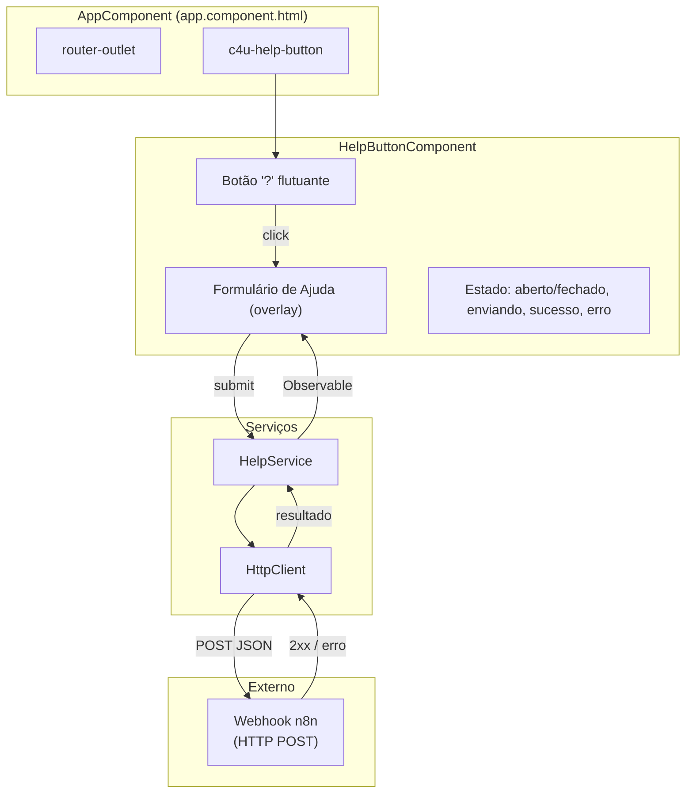

# Documento de Design: Botão Global de Ajuda

## Visão Geral

Este documento descreve a implementação de um botão flutuante global de ajuda ("?") para a aplicação Angular 16. O componente aparece em todas as páginas — login, dashboards, etc. — e permite que qualquer usuário reporte problemas através de um formulário. Os dados são enviados via HTTP POST para um webhook externo do n8n.

### Decisões de Design

1. **Componente no AppComponent**: O botão será adicionado diretamente no template do `AppComponent` (`app.component.html`), garantindo presença em todas as rotas sem necessidade de importação em cada módulo.

2. **Componente Standalone**: O `HelpButtonComponent` será um componente standalone (Angular 16 suporta), simplificando a integração — basta importá-lo no `AppModule`.

3. **Serviço dedicado `HelpService`**: Um serviço `HelpService` encapsula a lógica de envio HTTP POST para o webhook, separando responsabilidades do componente de UI.

4. **HttpClient direto**: O envio para o webhook externo usará `HttpClient` diretamente (não o `FunifierApiService`), pois o endpoint não faz parte da API Funifier e não requer autenticação.

5. **Reactive Forms**: O formulário usará `ReactiveFormsModule` para validação declarativa e testável dos campos.

6. **Acessibilidade nativa**: O formulário terá `role="dialog"`, `aria-labelledby`, trap de foco e navegação por teclado (Tab/Escape).

## Arquitetura



### Fluxo de Dados

1. O `AppComponent` renderiza `<c4u-help-button>` ao lado do `<router-outlet>`
2. O usuário clica no botão "?" → o overlay do formulário é exibido
3. O usuário preenche nome, e-mail e descrição → validação reativa em tempo real
4. Ao submeter, `HelpService.submitReport()` faz HTTP POST para o webhook
5. Resposta 2xx → mensagem de sucesso, formulário limpo
6. Erro → mensagem de erro exibida ao usuário

## Componentes e Interfaces

### HelpButtonComponent

```typescript
@Component({
  selector: 'c4u-help-button',
  standalone: true,
  imports: [CommonModule, ReactiveFormsModule],
  templateUrl: './c4u-help-button.component.html',
  styleUrls: ['./c4u-help-button.component.scss']
})
export class HelpButtonComponent implements OnInit, OnDestroy {
  isOpen = false;
  isSubmitting = false;
  submitSuccess = false;
  submitError = false;
  helpForm: FormGroup;

  toggle(): void { /* alterna isOpen */ }
  close(): void { /* fecha o formulário */ }
  onSubmit(): void { /* valida e envia via HelpService */ }
  onOverlayClick(event: MouseEvent): void { /* fecha se clicou fora */ }
  onKeydown(event: KeyboardEvent): void { /* Escape fecha */ }
}
```

### HelpService

```typescript
export interface HelpReportPayload {
  nome: string;
  email: string;
  descricao: string;
  pagina: string;      // URL atual (window.location.href)
  timestamp: string;    // ISO 8601
}

@Injectable({ providedIn: 'root' })
export class HelpService {
  private readonly webhookUrl = 'https://integrador-n8n.grupo4u.com.br/webhook-test/c43002e5-a4de-4e52-9b93-1ae39e0d38b6';

  constructor(private http: HttpClient) {}

  submitReport(payload: HelpReportPayload): Observable<any> {
    return this.http.post(this.webhookUrl, payload, {
      headers: new HttpHeaders({ 'Content-Type': 'application/json' })
    });
  }

  buildPayload(formValue: { nome: string; email: string; descricao: string }): HelpReportPayload {
    return {
      ...formValue,
      pagina: window.location.href,
      timestamp: new Date().toISOString()
    };
  }
}
```

### Validação do Formulário

```typescript
// Dentro de HelpButtonComponent.ngOnInit()
this.helpForm = new FormGroup({
  nome: new FormControl('', [Validators.required, Validators.minLength(2)]),
  email: new FormControl('', [Validators.required, Validators.email]),
  descricao: new FormControl('', [Validators.required, Validators.minLength(10)])
});
```

### Template do Formulário (estrutura simplificada)

```html
<!-- Botão flutuante -->
<button class="help-fab" (click)="toggle()" 
        [attr.aria-label]="isOpen ? 'Fechar formulário de ajuda' : 'Abrir formulário de ajuda'"
        [attr.aria-expanded]="isOpen">
  ?
</button>

<!-- Overlay do formulário -->
<div class="help-overlay" *ngIf="isOpen" (click)="onOverlayClick($event)" 
     (keydown)="onKeydown($event)" role="dialog" aria-labelledby="help-form-title">
  <div class="help-form-container" (click)="$event.stopPropagation()">
    <h2 id="help-form-title">Reportar Problema</h2>
    <button class="help-close-btn" (click)="close()" aria-label="Fechar">×</button>
    
    <form [formGroup]="helpForm" (ngSubmit)="onSubmit()">
      <label for="help-nome">Nome</label>
      <input id="help-nome" formControlName="nome" type="text" />
      
      <label for="help-email">E-mail</label>
      <input id="help-email" formControlName="email" type="email" />
      
      <label for="help-descricao">Descrição do Problema</label>
      <textarea id="help-descricao" formControlName="descricao"></textarea>
      
      <button type="submit" [disabled]="helpForm.invalid || isSubmitting">
        {{ isSubmitting ? 'Enviando...' : 'Enviar' }}
      </button>
    </form>
    
    <div *ngIf="submitSuccess" role="alert">Reporte enviado com sucesso!</div>
    <div *ngIf="submitError" role="alert">Erro ao enviar. Tente novamente.</div>
  </div>
</div>
```

### Integração no AppComponent

```html
<!-- app.component.html atualizado -->
<div id="toolTip"></div>
<div *ngIf="loadingProvider.show">
  <c4u-spinner></c4u-spinner>
</div>

<router-outlet *ngIf="translateReady && paramReady"></router-outlet>

<c4u-help-button></c4u-help-button>
```

## Modelos de Dados

### HelpReportPayload

| Campo       | Tipo     | Descrição                                      |
|-------------|----------|-------------------------------------------------|
| `nome`      | `string` | Nome do usuário que reporta o problema          |
| `email`     | `string` | E-mail de contato do usuário                    |
| `descricao` | `string` | Descrição detalhada do problema encontrado      |
| `pagina`    | `string` | URL da página onde o usuário estava (auto-capturada) |
| `timestamp` | `string` | Data/hora do reporte em formato ISO 8601        |

### Estado do Componente

| Propriedade    | Tipo      | Descrição                                    |
|----------------|-----------|----------------------------------------------|
| `isOpen`       | `boolean` | Se o formulário está visível                 |
| `isSubmitting` | `boolean` | Se o envio está em andamento                 |
| `submitSuccess`| `boolean` | Se o último envio foi bem-sucedido           |
| `submitError`  | `boolean` | Se o último envio falhou                     |
| `helpForm`     | `FormGroup` | Instância do formulário reativo            |

### Regras de Validação

| Campo       | Regras                                          |
|-------------|--------------------------------------------------|
| `nome`      | Obrigatório, mínimo 2 caracteres                |
| `email`     | Obrigatório, formato de e-mail válido            |
| `descricao` | Obrigatório, mínimo 10 caracteres               |


## Propriedades de Corretude

*Uma propriedade é uma característica ou comportamento que deve ser verdadeiro em todas as execuções válidas de um sistema — essencialmente, uma declaração formal sobre o que o sistema deve fazer. Propriedades servem como ponte entre especificações legíveis por humanos e garantias de corretude verificáveis por máquina.*

### Propriedade 1: Round-trip de abertura/fechamento

*Para qualquer* estado do componente onde o formulário está fechado, clicar no botão de ajuda deve abrir o formulário, e em seguida clicar no botão de fechar (ou fora do formulário, ou pressionar Escape) deve retornar o componente ao estado fechado com `isOpen === false`.

**Valida: Requisitos 2.1, 2.3**

### Propriedade 2: Formulário inválido mantém botão desabilitado

*Para qualquer* combinação de valores dos campos nome, e-mail e descrição onde pelo menos um campo obrigatório está vazio ou o e-mail tem formato inválido, o formulário deve ser inválido (`helpForm.invalid === true`) e o botão de envio deve estar desabilitado.

**Valida: Requisitos 4.1, 4.4**

### Propriedade 3: Mensagens de validação para entrada inválida

*Para qualquer* campo obrigatório deixado vazio após interação (touched), a mensagem de validação correspondente deve ser exibida. *Para qualquer* string que não seja um formato de e-mail válido no campo e-mail, a mensagem de validação de e-mail deve ser exibida.

**Valida: Requisitos 4.2, 4.3**

### Propriedade 4: Submissão válida envia payload correto

*Para qualquer* conjunto válido de dados do formulário (nome não-vazio, e-mail válido, descrição não-vazia), ao submeter, o sistema deve enviar um HTTP POST para a webhook URL contendo um payload JSON com os campos: nome, email, descricao, pagina e timestamp.

**Valida: Requisitos 5.1, 5.2**

### Propriedade 5: Submissão bem-sucedida limpa o formulário

*Para qualquer* submissão que retorne status HTTP 2xx, o formulário deve ser resetado (todos os campos limpos), `submitSuccess` deve ser `true` e `submitError` deve ser `false`.

**Valida: Requisitos 5.3**

### Propriedade 6: Falha na submissão exibe erro

*Para qualquer* submissão que resulte em erro (rede ou status HTTP não-2xx), `submitError` deve ser `true`, `submitSuccess` deve ser `false`, e os dados do formulário devem ser preservados (não limpos).

**Valida: Requisitos 5.4**

### Propriedade 7: Botão desabilitado durante envio

*Para qualquer* estado onde `isSubmitting === true`, o botão de envio deve estar desabilitado e exibir indicador de carregamento. Não deve ser possível disparar uma segunda submissão enquanto a primeira está em andamento.

**Valida: Requisitos 5.5**

### Propriedade 8: Foco movido ao abrir formulário

*Para qualquer* transição de estado de `isOpen === false` para `isOpen === true`, o foco do teclado deve ser movido para o primeiro campo do formulário (campo nome).

**Valida: Requisitos 6.3**

### Propriedade 9: Escape fecha o formulário

*Para qualquer* estado onde o formulário está aberto (`isOpen === true`), pressionar a tecla Escape deve fechar o formulário (`isOpen === false`).

**Valida: Requisitos 6.4**

### Propriedade 10: Round-trip de construção do payload

*Para qualquer* objeto de formulário válido com nome, email e descrição, `buildPayload()` deve produzir um `HelpReportPayload` que contém exatamente os mesmos valores de nome, email e descricao do input, além de campos `pagina` e `timestamp` não-vazios.

**Valida: Requisitos 5.2**

## Tratamento de Erros

### Falha no Envio HTTP

Quando o POST para o webhook falha (erro de rede, timeout, status não-2xx):

1. O `Observable` retornado por `HelpService.submitReport()` emite erro
2. O componente captura o erro no `subscribe` / `catchError`
3. `isSubmitting` é definido como `false`
4. `submitError` é definido como `true`
5. Os dados do formulário são preservados para que o usuário possa tentar novamente
6. Uma mensagem de erro é exibida: "Erro ao enviar. Tente novamente."

```typescript
onSubmit(): void {
  if (this.helpForm.invalid || this.isSubmitting) return;

  this.isSubmitting = true;
  this.submitSuccess = false;
  this.submitError = false;

  const payload = this.helpService.buildPayload(this.helpForm.value);

  this.helpService.submitReport(payload).subscribe({
    next: () => {
      this.isSubmitting = false;
      this.submitSuccess = true;
      this.helpForm.reset();
    },
    error: () => {
      this.isSubmitting = false;
      this.submitError = true;
    }
  });
}
```

### Validação de Formulário

| Cenário | Comportamento |
|---------|---------------|
| Nome vazio | Campo marcado como inválido, mensagem "Nome é obrigatório" |
| Nome < 2 caracteres | Mensagem "Nome deve ter pelo menos 2 caracteres" |
| E-mail vazio | Campo marcado como inválido, mensagem "E-mail é obrigatório" |
| E-mail formato inválido | Mensagem "Formato de e-mail inválido" |
| Descrição vazia | Campo marcado como inválido, mensagem "Descrição é obrigatória" |
| Descrição < 10 caracteres | Mensagem "Descrição deve ter pelo menos 10 caracteres" |
| Todos os campos válidos | Botão de envio habilitado |

### Casos Extremos

| Cenário | Comportamento |
|---------|---------------|
| Duplo clique no botão de envio | `isSubmitting` previne envios duplicados |
| Webhook retorna 500 | Mensagem de erro, dados preservados |
| Perda de conexão durante envio | Erro capturado, mensagem exibida |
| Formulário aberto + navegação de rota | Componente persiste (está no AppComponent) |
| Campos com apenas espaços em branco | Validação `required` do Angular rejeita strings vazias após trim |

## Estratégia de Testes

### Testes Unitários

Testes unitários verificam exemplos específicos e casos extremos:

1. **HelpService**
   - `submitReport()` faz POST para a URL correta com payload correto
   - `buildPayload()` inclui todos os campos obrigatórios
   - `buildPayload()` captura a URL da página atual
   - `buildPayload()` gera timestamp em formato ISO 8601

2. **HelpButtonComponent**
   - Componente renderiza o botão "?" quando fechado
   - Clicar no botão abre o formulário
   - Clicar no botão de fechar fecha o formulário
   - Clicar fora do formulário fecha o formulário
   - Formulário contém campos nome, e-mail e descrição
   - Formulário contém rótulos em português
   - Botão de envio desabilitado quando formulário inválido
   - Mensagens de validação exibidas para campos vazios
   - Mensagem de validação para e-mail inválido
   - Sucesso no envio limpa o formulário e exibe mensagem
   - Erro no envio preserva dados e exibe mensagem de erro
   - Botão "?" possui `aria-label`
   - Formulário possui `role="dialog"` e `aria-labelledby`
   - Foco move para primeiro campo ao abrir
   - Escape fecha o formulário

### Testes Property-Based

Testes property-based verificam propriedades universais com muitas entradas geradas aleatoriamente. Cada teste executa no mínimo 100 iterações.

**Biblioteca**: `fast-check` (biblioteca de testes property-based para JavaScript/TypeScript)

1. **Teste: Round-trip abertura/fechamento**
   - Gerar sequências aleatórias de ações (abrir, fechar, clicar fora, Escape)
   - Verificar que o estado final é consistente com as ações aplicadas
   - **Tag**: Feature: global-help-button, Property 1: Round-trip de abertura/fechamento

2. **Teste: Formulário inválido mantém botão desabilitado**
   - Gerar combinações aleatórias de valores para os 3 campos (incluindo strings vazias, whitespace, e-mails inválidos)
   - Verificar que quando qualquer campo é inválido, `helpForm.invalid === true`
   - **Tag**: Feature: global-help-button, Property 2: Formulário inválido mantém botão desabilitado

3. **Teste: Mensagens de validação para entrada inválida**
   - Gerar strings aleatórias para o campo e-mail (incluindo strings sem @, sem domínio, etc.)
   - Verificar que strings que não são e-mails válidos produzem erro de validação
   - **Tag**: Feature: global-help-button, Property 3: Mensagens de validação para entrada inválida

4. **Teste: Submissão válida envia payload correto**
   - Gerar nomes, e-mails e descrições válidos aleatórios
   - Verificar que o payload enviado contém todos os campos com os valores corretos
   - **Tag**: Feature: global-help-button, Property 4: Submissão válida envia payload correto

5. **Teste: Submissão bem-sucedida limpa o formulário**
   - Gerar dados válidos aleatórios, simular resposta 2xx
   - Verificar que o formulário é resetado após sucesso
   - **Tag**: Feature: global-help-button, Property 5: Submissão bem-sucedida limpa o formulário

6. **Teste: Falha na submissão exibe erro**
   - Gerar dados válidos aleatórios, simular erros HTTP variados (400, 500, 0, timeout)
   - Verificar que `submitError === true` e dados do formulário preservados
   - **Tag**: Feature: global-help-button, Property 6: Falha na submissão exibe erro

7. **Teste: Botão desabilitado durante envio**
   - Gerar dados válidos, iniciar submissão sem resolver o Observable
   - Verificar que `isSubmitting === true` e botão desabilitado
   - **Tag**: Feature: global-help-button, Property 7: Botão desabilitado durante envio

8. **Teste: Foco movido ao abrir formulário**
   - Gerar sequências aleatórias de abrir/fechar
   - Verificar que após cada abertura, o foco está no campo nome
   - **Tag**: Feature: global-help-button, Property 8: Foco movido ao abrir formulário

9. **Teste: Escape fecha o formulário**
   - Gerar estados aleatórios do formulário (com/sem dados preenchidos)
   - Verificar que Escape sempre fecha independente do estado do formulário
   - **Tag**: Feature: global-help-button, Property 9: Escape fecha o formulário

10. **Teste: Round-trip de construção do payload**
    - Gerar objetos de formulário válidos aleatórios
    - Verificar que `buildPayload()` preserva nome, email e descricao, e adiciona pagina e timestamp não-vazios
    - **Tag**: Feature: global-help-button, Property 10: Round-trip de construção do payload

### Configuração dos Testes

```typescript
import * as fc from 'fast-check';

const propertyTestConfig = { numRuns: 100 };

// Exemplo de gerador para dados válidos do formulário
const validFormData = fc.record({
  nome: fc.string({ minLength: 2, maxLength: 100 }).filter(s => s.trim().length >= 2),
  email: fc.emailAddress(),
  descricao: fc.string({ minLength: 10, maxLength: 1000 }).filter(s => s.trim().length >= 10)
});
```
