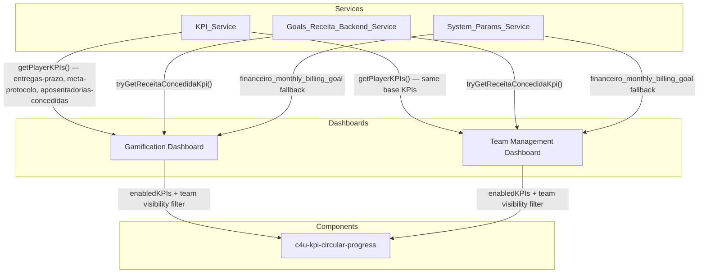

# Design Document: KPI Bars Revision

## Overview

This design covers the revision of KPI circular progress bars across the gamification application dashboards. The changes involve:

1. **Removing** the "Clientes atendidos" (`numero-empresas`) KPI bar from `KPI_Service` at the source, so no dashboard receives it.
2. **Preserving** the "Valor concedido" (`valor-concedido`) KPI bar for finance team only (already implemented, no changes needed).
3. **Adding** a new "Meta de protocolo" (`meta-protocolo`) KPI bar with R$ currency formatting and a hardcoded target.
4. **Adding** a new "Aposentadorias concedidas" (`aposentadorias-concedidas`) KPI bar with count formatting and a hardcoded target.
5. **Fixing** the goals endpoint meta value override bug where `loadFinanceBillingKpiLikeTeamManagement` unconditionally falls back to `financeiro_monthly_billing_goal` even when the goals backend returns a valid target.
6. **Supporting** team-specific KPI visibility via a configurable filter in the `enabledKPIs` getters.

The primary dashboards affected are `gamification-dashboard` (player view) and `team-management-dashboard` (manager view). The supervisor/director views use the same `team-management-dashboard` component with different role-based access, so changes propagate automatically.

### Key Design Decisions

- **Remove at source**: Instead of filtering `numero-empresas` in each dashboard's `enabledKPIs` getter, we remove it from `KPI_Service.getPlayerKPIs()` and `getPlayerKPIsForDateRange()`. This is cleaner and ensures no downstream consumer accidentally displays it.
- **Hardcoded targets with TODO markers**: The new KPIs use hardcoded target values with clear `// TODO:` comments and a configuration constant, making future migration to `metric_targets__c` or `System_Params_Service` straightforward.
- **Reuse existing KPIData model**: No model changes needed — the existing `KPIData` interface supports all required fields (`id`, `label`, `current`, `target`, `superTarget`, `unit`, `color`, `percentage`).
- **Team visibility via configuration map**: A simple `Record<string, string[]>` maps team IDs to allowed KPI IDs, with a default "show all" fallback.

## Architecture



### Change Flow

1. `KPI_Service.getPlayerKPIs()` stops generating `numero-empresas` KPI. Instead generates `meta-protocolo` and `aposentadorias-concedidas`.
2. `KPI_Service.getPlayerKPIsForDateRange()` mirrors the same change for season-range queries.
3. `gamification-dashboard` `enabledKPIs` getter applies team-visibility filtering.
4. `team-management-dashboard` `enabledKPIs` getter applies team-visibility filtering (already filters `numero-empresas` and `valor-concedido`; updated to include new KPIs).
5. Finance billing KPI injection (`maybeInjectFinanceBillingKpiForPlayer` / `appendFinanceValorConcedidoKpiIfFinance`) is fixed to respect the goals backend target when > 0.
6. `c4u-kpi-circular-progress` already handles R$ currency formatting and count display — no component changes needed.

## Components and Interfaces

### KPI_Service Changes (`kpi.service.ts`)

**Removed KPI generation:**
- Remove all code that creates `{ id: 'numero-empresas', ... }` KPIData objects from `getPlayerKPIs()` and `getPlayerKPIsForDateRange()`.
- Remove the `userActionDashboard.getDeliveryCount()` and `getDeliveryCountInRange()` calls that were only used for `numero-empresas`.

**New KPI generation — added to `getPlayerKPIs()` and `getPlayerKPIsForDateRange()`:**

```typescript
// --- Hardcoded targets (TODO: migrate to metric_targets__c or System_Params_Service) ---
const META_PROTOCOLO_TARGET = 1_000_000;       // R$ 1.000.000
const APOSENTADORIAS_TARGET = 220;              // 220 concedidos

// Meta de protocolo KPI
kpis.push({
  id: 'meta-protocolo',
  label: 'Meta de protocolo',
  current: /* value from player/team data source */,
  target: META_PROTOCOLO_TARGET,
  superTarget: Math.ceil(META_PROTOCOLO_TARGET * 1.5),
  unit: 'R$',
  color: this.getKPIColorByGoals(current, META_PROTOCOLO_TARGET, superTarget),
  percentage: META_PROTOCOLO_TARGET > 0 ? Math.round((current / META_PROTOCOLO_TARGET) * 100) : 0
});

// Aposentadorias concedidas KPI
kpis.push({
  id: 'aposentadorias-concedidas',
  label: 'Aposentadorias concedidas',
  current: /* value from player/team data source */,
  target: APOSENTADORIAS_TARGET,
  superTarget: Math.ceil(APOSENTADORIAS_TARGET * 1.5),
  unit: 'concedidos',
  color: this.getKPIColorByGoals(current, APOSENTADORIAS_TARGET, superTarget),
  percentage: APOSENTADORIAS_TARGET > 0 ? Math.round((current / APOSENTADORIAS_TARGET) * 100) : 0
});
```

**New method signature for team-aware KPI generation:**

```typescript
getPlayerKPIs(
  playerId: string,
  selectedMonth?: Date,
  _actionLogService?: unknown,
  teamId?: string  // NEW: optional team identifier for visibility filtering
): Observable<KPIData[]>
```

### Gamification Dashboard Changes (`gamification-dashboard.component.ts`)

**`enabledKPIs` getter update:**

```typescript
get enabledKPIs(): KPIData[] {
  return this.playerKPIs.filter(kpi => {
    // numero-empresas removed at source, but defensive filter
    if (kpi.id === 'numero-empresas') return false;
    // valor-concedido only for finance team
    if (kpi.id === 'valor-concedido' && !this.isFinanceTeamMember()) return false;
    // Team-specific visibility
    return this.isKpiVisibleForTeam(kpi.id);
  });
}
```

**Goals meta fix in `loadFinanceBillingKpiLikeTeamManagement()`:**

```typescript
// BEFORE (bug): always overrides with paramTarget when goalsKpi.target is 0
targetBilling = goalsKpi.target > 0 ? goalsKpi.target : paramTarget;

// AFTER (fix): use goalsKpi.target as-is when goals backend returns valid data
if (goalsKpi != null) {
  safeCurrentBilling = goalsKpi.current;
  // Use goals backend target directly; only fall back to param if goals target is 0
  targetBilling = goalsKpi.target > 0 ? goalsKpi.target : paramTarget;
  // ... rest unchanged
}
```

Note: The current code already has this logic. The actual bug is in the `else` branch where `paramTarget` is used as the sole source. The fix ensures that when `goalsKpi` is non-null and has a valid target, we never override it with `paramTarget`. The existing code is correct for this case. The real fix is ensuring `paramTarget` doesn't override a valid `goalsKpi.target` — which requires reviewing the `paramTarget` computation to ensure it's truly a fallback, not an override.

### Team Management Dashboard Changes (`team-management-dashboard.component.ts`)

**`enabledKPIs` getter update:**

```typescript
get enabledKPIs(): KPIData[] {
  return this.teamKPIs.filter(kpi => {
    if (kpi.id === 'numero-empresas') return false;
    if (kpi.id === 'valor-concedido' && !this.isSelectedFinanceTeam()) return false;
    // Team-specific visibility for new KPIs
    return this.isKpiVisibleForTeam(kpi.id, this.selectedTeamId);
  });
}
```

### Team-Specific KPI Visibility Configuration

```typescript
// Shared constant or injected configuration
// Maps team IDs to arrays of KPI IDs that team should see
// Empty array or missing key = show all default KPIs
const TEAM_KPI_VISIBILITY: Record<string, string[]> = {
  // Example: '6': ['valor-concedido', 'meta-protocolo']
  // Default: all teams see meta-protocolo and aposentadorias-concedidas
};

// Default KPIs visible to all teams (when no team-specific config exists)
const DEFAULT_VISIBLE_KPIS = [
  'entregas-prazo',
  'meta-protocolo',
  'aposentadorias-concedidas'
];
```

**Visibility helper method (added to both dashboards or extracted to a shared utility):**

```typescript
private isKpiVisibleForTeam(kpiId: string, teamId?: string): boolean {
  if (!teamId || !TEAM_KPI_VISIBILITY[teamId]) {
    return DEFAULT_VISIBLE_KPIS.includes(kpiId) || kpiId === 'valor-concedido';
  }
  return TEAM_KPI_VISIBILITY[teamId].includes(kpiId);
}
```

### c4u-kpi-circular-progress Component

No changes needed. The component already supports:
- R$ currency formatting via `unit === 'R$'` in `displayValue` getter
- Count display for non-currency, non-percentage units
- Color determination via `color` input
- All required `KPIData` fields as `@Input()` properties

### Template Changes

**gamification-dashboard.component.html**: The `*ngFor="let kpi of enabledKPIs"` and `*ngFor="let kpi of playerKPIs"` loops already render whatever KPIs are in the array. No template changes needed since filtering happens in the getter.

**team-management-dashboard.component.html**: Remove the `*ngIf="kpi.id === 'numero-empresas'"` conditional rendering block. Simplify to use `enabledKPIs` consistently:

```html
<ng-container *ngFor="let kpi of enabledKPIs; let i = index; trackBy: trackByKpiId">
  <c4u-kpi-circular-progress
    [label]="kpi.label"
    [current]="roundValue(kpi.current)"
    [target]="roundValue(kpi.target)"
    [superTarget]="kpi.superTarget"
    [color]="kpi.color"
    [unit]="kpi.unit"
    [colorIndex]="i"
    [animateProgressFromPercent]="kpi.animateProgressFromPercent ?? null"
    [progressEvolutionLabel]="kpi.progressEvolutionLabel ?? null">
  </c4u-kpi-circular-progress>
</ng-container>
```

## Data Models

### KPIData Interface (unchanged)

```typescript
export interface KPIData {
  id: string;                              // e.g., 'meta-protocolo', 'aposentadorias-concedidas'
  label: string;                           // e.g., 'Meta de protocolo'
  current: number;                         // Current value
  target: number;                          // Target value
  superTarget?: number;                    // 150% of target
  unit?: string;                           // 'R$', 'concedidos', '%', 'clientes'
  color?: 'red' | 'yellow' | 'green';     // Goal-based color
  percentage?: number;                     // Progress percentage (0-100)
  animateProgressFromPercent?: number;     // Animation start point
  progressEvolutionLabel?: string;         // Evolution label text
}
```

### New KPI Definitions

| KPI ID | Label | Unit | Default Target | Data Source |
|--------|-------|------|----------------|-------------|
| `meta-protocolo` | Meta de protocolo | R$ | 1,000,000 (hardcoded) | Player/team extra data |
| `aposentadorias-concedidas` | Aposentadorias concedidas | concedidos | 220 (hardcoded) | Player/team extra data |

### Removed KPI

| KPI ID | Label | Reason |
|--------|-------|--------|
| `numero-empresas` | Clientes atendidos | No longer relevant; removed from all dashboards |


## Correctness Properties

*A property is a characteristic or behavior that should hold true across all valid executions of a system — essentially, a formal statement about what the system should do. Properties serve as the bridge between human-readable specifications and machine-verifiable correctness guarantees.*

### Property 1: numero-empresas exclusion invariant

*For any* player data input and any selected month or date range, the KPIData array returned by `KPI_Service.getPlayerKPIs()` and `KPI_Service.getPlayerKPIsForDateRange()` SHALL contain zero items with `id === 'numero-empresas'`, and the `enabledKPIs` getter on both Gamification_Dashboard and Team_Management_Dashboard SHALL also contain zero such items.

**Validates: Requirements 1.1, 1.2, 1.3, 1.5, 1.6, 2.2**

### Property 2: New KPIs structural correctness

*For any* player data input, the KPIData array returned by `KPI_Service.getPlayerKPIs()` SHALL contain an item with `id === 'meta-protocolo'`, `label === 'Meta de protocolo'`, `unit === 'R$'`, and `target` equal to the hardcoded `META_PROTOCOLO_TARGET` constant; AND an item with `id === 'aposentadorias-concedidas'`, `label === 'Aposentadorias concedidas'`, `unit === 'concedidos'`, and `target` equal to the hardcoded `APOSENTADORIAS_TARGET` constant.

**Validates: Requirements 3.1, 3.2, 4.1, 4.2**

### Property 3: New KPIs current value from data source

*For any* player data containing known numeric values for protocol and retirement metrics, the `current` field of the `meta-protocolo` KPI SHALL equal the protocol metric value from the player data, and the `current` field of the `aposentadorias-concedidas` KPI SHALL equal the retirement metric value from the player data.

**Validates: Requirements 3.3, 4.3**

### Property 4: Currency and count display formatting

*For any* KPIData with `unit === 'R$'` and any non-negative `current` value, the `c4u-kpi-circular-progress` component's `displayValue` SHALL produce a string formatted as Brazilian Real currency (e.g., "R$ 446.000"). *For any* KPIData with a non-currency, non-percentage unit (e.g., `concedidos`) and any non-negative `current` value, the `displayValue` SHALL produce a string containing the rounded integer count.

**Validates: Requirements 3.4, 4.4**

### Property 5: Valor-concedido finance-only visibility

*For any* user profile, if the user belongs to Finance_Team (team_id '6' or team name containing "financeiro"), then `enabledKPIs` SHALL include an item with `id === 'valor-concedido'`. *For any* user profile where the user does NOT belong to Finance_Team, `enabledKPIs` SHALL contain zero items with `id === 'valor-concedido'`.

**Validates: Requirements 2.1, 2.3, 2.4**

### Property 6: Goals target resolution with correct fallback

*For any* set of goal log rows where the most recent row has `current_goal_value > 0`, the resolved `targetBilling` for the `valor-concedido` KPI SHALL equal that `current_goal_value` and SHALL NOT be overridden by the `financeiro_monthly_billing_goal` system parameter. *For any* scenario where the goals backend returns null or a target of zero, the `targetBilling` SHALL equal the `financeiro_monthly_billing_goal` system parameter value.

**Validates: Requirements 5.1, 5.2, 5.3, 5.4**

### Property 7: Team-specific KPI visibility filtering

*For any* team with a configured visibility list in `TEAM_KPI_VISIBILITY`, the `enabledKPIs` getter SHALL return only KPIs whose `id` appears in that team's visibility list. *For any* team without a configured visibility list, the `enabledKPIs` getter SHALL return all KPIs in `DEFAULT_VISIBLE_KPIS`.

**Validates: Requirements 6.2, 6.4**

## Error Handling

### KPI_Service Errors

| Scenario | Handling |
|----------|----------|
| Player data fetch fails | Return empty KPIData array (existing behavior). New KPIs (`meta-protocolo`, `aposentadorias-concedidas`) are not generated. |
| Player extra data missing protocol/retirement fields | Set `current` to 0 for the respective KPI. Still generate the KPI with target and 0% progress. |
| Invalid numeric values in player data | Use `parseFloat` with fallback to 0. Existing `getKPIColorByGoals` handles 0 current gracefully (returns `'red'`). |

### Goals Backend Errors

| Scenario | Handling |
|----------|----------|
| `tryGetReceitaConcedidaKpi()` throws | Catch and fall back to Omie service + `financeiro_monthly_billing_goal` param (existing behavior). |
| Goals backend returns no matching log rows | Return null, triggering the Omie fallback path. Log warning about template ID mismatch. |
| Both goals backend and system param return 0 | Display `valor-concedido` with target 0, percentage 0, color `'red'`. |

### Team Visibility Errors

| Scenario | Handling |
|----------|----------|
| `TEAM_KPI_VISIBILITY` config missing for team | Fall back to `DEFAULT_VISIBLE_KPIS` — show all default KPIs. |
| Team ID is null/undefined | Treat as "no team config" — use default visibility. |

## Testing Strategy

### Unit Tests (Example-Based)

- **KPI_Service**: Verify `getPlayerKPIs()` returns correct KPIs for specific player data scenarios (finance team member, non-finance team member, missing extra data).
- **enabledKPIs getter**: Verify filtering for specific team/user combinations (finance team sees valor-concedido, non-finance doesn't).
- **Goals meta fix**: Verify that when `goalsKpi.target > 0`, the dashboard uses it directly; when null/zero, falls back to system param.
- **Template rendering**: Verify the team-management-dashboard HTML no longer has `*ngIf="kpi.id === 'numero-empresas'"` conditional blocks.
- **Edge cases**: Both goals and system param return 0; player data has no extra fields; team visibility config is empty.

### Property-Based Tests

Property-based testing is appropriate for this feature because the KPI filtering and generation logic involves pure functions with clear input/output behavior and universal invariants that should hold across a wide range of inputs.

**Library**: [fast-check](https://github.com/dubzzz/fast-check) (already available in the project's test ecosystem via Jest)

**Configuration**: Minimum 100 iterations per property test.

**Tag format**: `Feature: kpi-bars-revision, Property {number}: {property_text}`

| Property | Test Description | Generators |
|----------|-----------------|------------|
| P1 | numero-empresas never in output | Random KPIData arrays with/without numero-empresas items |
| P2 | New KPIs have correct structure | Random player extra data objects |
| P3 | Current values match data source | Random player extra data with known numeric fields |
| P4 | R$ formatting and count formatting | Random non-negative numbers for current values |
| P5 | valor-concedido visibility by team | Random user profiles (finance/non-finance) |
| P6 | Goals target resolution | Random goalsKpi results (null, zero target, positive target) + random paramTarget values |
| P7 | Team visibility filtering | Random TEAM_KPI_VISIBILITY configs + random KPIData arrays |

### Integration Tests

- End-to-end flow: Load gamification-dashboard for a finance team user → verify valor-concedido appears, numero-empresas does not, meta-protocolo and aposentadorias-concedidas appear.
- End-to-end flow: Load team-management-dashboard for a non-finance team → verify valor-concedido does not appear, new KPIs appear.
- Goals backend integration: Mock `/goals/logs` response with valid target → verify KPI bar shows correct target without override.
