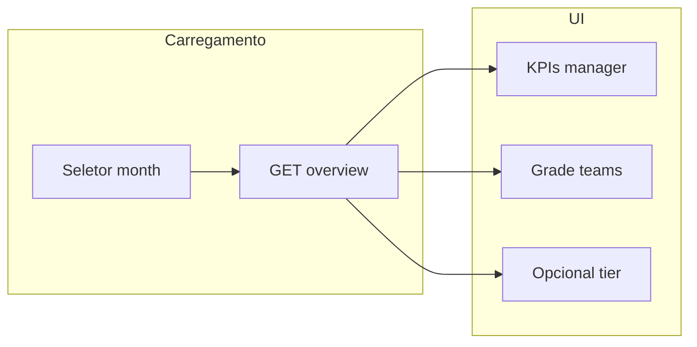

# Painel de gestão (GERENTE / DIRETOR / C-LEVEL) — integração frontend

Guia para consumir **`manager_dashboard_report_cache`** e o escopo de times em **`user_role_team_month`**, sem montar intervalos de data no cliente.

Documentação técnica: [game-reports-rpc.md](./game-reports-rpc.md#gestão-agregada-cache-por-usuário).

Relacionado: [supervision-dashboard-cached-frontend.md](./supervision-dashboard-cached-frontend.md) (detalhe por time), [player-dashboard-cached-frontend.md](./player-dashboard-cached-frontend.md) (drill-down jogador).

---

## Resumo

| Conceito | Detalhe |
|----------|---------|
| Tabela principal | `manager_dashboard_report_cache` — **1 linha por gestor + mês** (KPIs agregados) |
| Escopo de times | `user_role_team_month` — quais `team_id` entram no painel (organograma BWA) |
| Origem das métricas | Soma de `team_supervision_dashboard_report_cache` nos times do escopo |
| Papéis | `GERENTE`, `DIRETOR`, `C_LEVEL` (JWT deve ter assignment com esse papel) |
| Endpoint recomendado | **`GET /game/reports/management/dashboard/cached/overview`** |

**Não use** estas rotas com `PLAYER` ou `SUPERVISOR`/`GESTOR` (use [supervisão por time](./supervision-dashboard-cached-frontend.md)).

---

## Endpoint recomendado (1 chamada)

```
GET /game/reports/management/dashboard/cached/overview
```

Substitui, na tela principal de gestão, a combinação manual de:

- painel agregado do gestor;
- lista de times com KPIs;
- (opcional) visão da camada organizacional.

### Headers (obrigatórios)

| Header | Valor |
|--------|--------|
| `Authorization` | `Bearer <access_token>` |
| `client_id` | Tenant (ex.: `bwa`) |

### Query

| Parâmetro | Obrigatório | Descrição |
|-----------|-------------|-----------|
| `month` | Sim | `YYYY-MM` ou `YYYY-MM-DD` (ex.: `2026-05`) |
| `user_id` | Não | Só **ADMIN** / **SERVICE**: consultar outro gestor |

### Exemplo

```http
GET /game/reports/management/dashboard/cached/overview?month=2026-05
Authorization: Bearer <token>
client_id: bwa
```

```bash
curl -sS -G "https://<API_BASE>/game/reports/management/dashboard/cached/overview" \
  -H "Authorization: Bearer <TOKEN>" \
  -H "client_id: bwa" \
  --data-urlencode "month=2026-05"
```

### Resposta `200 OK`

```typescript
export interface PlayerDashboardCachedParams {
  cache_month: string;   // "2026-05-01"
  season_start: string;
  season_end: string;
  month_start: string;
  month_end: string;
}

export interface DashboardCacheMetrics {
  season_points_total: number;
  season_clients_total: number;
  season_tasks_finished_total: number;
  month_points_done_delivered: number;
  month_goal_points: number;
  month_pending_tasks_count: number;
  month_finished_tasks_count: number;
  month_clients_served: number;
  /** 0–100, até 2 casas decimais */
  month_on_time_delivery_pct: number;
}

export interface ManagerTeamRef {
  team_id: number;
  team_name: string | null;
}

/** Objeto `manager` — espelha manager_dashboard_report_cache */
export interface ManagerDashboardCached {
  refreshed_at: string;
  user_id: string;
  user_email: string;
  user_role: 'GERENTE' | 'DIRETOR' | 'C_LEVEL';
  teams_count: number;
  team_ids: number[];
  teams: ManagerTeamRef[];
  players_count: number;
  params: PlayerDashboardCachedParams;
  refresh_error?: string | null;
}

/** Cada item de `teams` — mesmo formato da supervisão por time */
export interface TeamSupervisionCached extends DashboardCacheMetrics {
  refreshed_at: string;
  team_id: number;
  team_name: string | null;
  players_count: number;
  params: PlayerDashboardCachedParams;
  refresh_error?: string | null;
}

/** Roll-up da camada do JWT (ex.: todos os GERENTES do client) */
export interface OrganizationalTierCached extends DashboardCacheMetrics {
  management_tier: 'GERENTE' | 'DIRETOR' | 'C_LEVEL';
  managers_count: number;
  refreshed_at: string;
  teams_count: number;
  team_ids: number[];
  teams: ManagerTeamRef[];
  players_count: number;
  params: PlayerDashboardCachedParams;
  refresh_error?: string | null;
}

export interface ManagementDashboardOverviewResponse {
  manager: ManagerDashboardCached;
  /** KPIs por time no escopo do gestor (ordenado por team_name) */
  teams: TeamSupervisionCached[];
  /** Comparativo da camada; null se não houver dados de tier no mês */
  organizational_tier: OrganizationalTierCached | null;
}
```

### Exemplo JSON (resumido)

```json
{
  "manager": {
    "refreshed_at": "2026-05-20T18:00:00.000Z",
    "user_id": "18da2080-2b52-42b1-8980-f99e59548430",
    "user_email": "gerente@bwa.global",
    "user_role": "GERENTE",
    "teams_count": 2,
    "team_ids": [37, 41],
    "teams": [
      { "team_id": 37, "team_name": "Time Norte" },
      { "team_id": 41, "team_name": "Time Sul" }
    ],
    "players_count": 24,
    "params": {
      "cache_month": "2026-05-01",
      "season_start": "2026-03-01",
      "season_end": "2026-06-30",
      "month_start": "2026-05-01",
      "month_end": "2026-05-31"
    },
    "season_points_total": 4800,
    "season_clients_total": 120,
    "season_tasks_finished_total": 320,
    "month_points_done_delivered": 900,
    "month_goal_points": 1100,
    "month_pending_tasks_count": 45,
    "month_finished_tasks_count": 88,
    "month_clients_served": 40,
    "month_on_time_delivery_pct": 82.5
  },
  "teams": [
    {
      "team_id": 37,
      "team_name": "Time Norte",
      "players_count": 12,
      "month_on_time_delivery_pct": 80,
      "month_finished_tasks_count": 40
    }
  ],
  "organizational_tier": {
    "management_tier": "GERENTE",
    "managers_count": 5,
    "teams_count": 18,
    "players_count": 140
  }
}
```

### Erros

| Status | Quando |
|--------|--------|
| **404** | Sem linha em `manager_dashboard_report_cache` para o usuário + `month` (cron não rodou ou gestor sem escopo) |
| **403** | `user_id` de outro gestor sem ser ADMIN/SERVICE |
| **401** | Token inválido |

---

## Mapeamento UI → campos

Use a **mesma tabela de KPIs** do [painel do jogador](./player-dashboard-cached-frontend.md#mapeamento-ui-antiga--campos-novos).

| Bloco na tela | Fonte no `overview` |
|---------------|---------------------|
| Cards / hero KPIs (totais do gestor) | `manager.*` |
| Grade “meus times” | `teams[]` |
| Cabeçalho “Gerência / Diretoria / C-Level” (opcional) | `organizational_tier` |
| Lista de times com nome | `manager.teams` ou `teams[].team_name` |
| “Atualizado em …” | `manager.refreshed_at` (ou max dos `teams`) |
| Subtítulo do período | `manager.params.month_start` … `month_end` |

### Drill-down

| Ação | Endpoint |
|------|----------|
| Abrir time (se não usar só `teams[]` do overview) | `GET /game/reports/supervision/dashboard/cached?team_id=&month=` |
| Abrir jogador do time | `GET /game/reports/dashboard/cached?email=&month=` |
| Deliveries do time | `GET /game/reports/finished/deliveries/cached?team_id=&month=` |
| Deliveries do jogador | `GET /game/reports/finished/deliveries/cached?email=&month=` |

---

## Endpoints granulares (opcional)

Use se a tela fizer refresh parcial ou não precisar da grade de times.

| Método | Rota | Uso |
|--------|------|-----|
| GET | `/game/reports/management/dashboard/cached/overview` | **Tela principal (recomendado)** |
| GET | `/game/reports/management/dashboard/cached` | Só `manager_dashboard_report_cache` |
| GET | `/game/reports/management/dashboard/cached/list` | Vários gestores (ADMIN) ou só si |
| GET | `/game/reports/management/dashboard/cached/tiers` | Só roll-up por camada (`GERENTE` / `DIRETOR` / `C_LEVEL`) |

### `GET .../cached` (somente manager)

```http
GET /game/reports/management/dashboard/cached?month=2026-05
```

Mesmo objeto que `overview.manager`.

### `GET .../cached/list`

| Quem | Resultado |
|------|-----------|
| ADMIN / SERVICE | Todos os gestores com cache no mês; filtro opcional `role=GERENTE` |
| GERENTE / DIRETOR / C_LEVEL | Apenas a própria linha |

```http
GET /game/reports/management/dashboard/cached/list?month=2026-05&role=GERENTE
```

Resposta: `{ "managers": ManagerDashboardCached[] }`.

### `GET .../cached/tiers`

| Quem | Resultado |
|------|-----------|
| ADMIN / SERVICE | Até 3 itens em `tiers[]` |
| GERENTE / DIRETOR / C_LEVEL | Só a camada do JWT |

Resposta: `{ "tiers": OrganizationalTierCached[] }`.

---

## Quem vê o quê (JWT)

| Papel no token | `overview` | `organizational_tier` |
|----------------|------------|------------------------|
| GERENTE | Painel + times do escopo dele | Roll-up camada GERENTE |
| DIRETOR | Idem | Roll-up camada DIRETOR |
| C_LEVEL | Idem (todos os times do client no escopo) | Roll-up C_LEVEL |
| ADMIN | Pode passar `user_id` | Todas as camadas em `/tiers` |
| PLAYER / GESTOR | **403** nestas rotas | — |

---

## Regras de negócio importantes

1. **`manager` ≠ soma aritmética de `teams`** em todos os campos — o backend agrega times do escopo em uma passagem (mesma regra da supervisão).
2. **`season_clients_total` / `month_clients_served`**: soma por jogador/time; **não** é “clientes únicos” no tenant.
3. **`month_on_time_delivery_pct`**: média ponderada por `month_finished_tasks_count` (no roll-up).
4. Ações com **`dismissed = true`** não entram no cache (jogador → time → gestor).
5. Escopo vem de **`user_role_team_month`**, não de `team.observers`.

---

## Pré-requisito de dados (backend / ops)

Ordem típica no ambiente:

```bash
npm run dashboard-cache:refresh-once -- --all --month=2026-05
# ou: teams-only + managers-only após jogadores

npm run organogram:seed-role-teams -- --month=2026-05
npm run dashboard-cache:refresh-once -- --managers-only --month=2026-05
```

Sem isso → **404** no `overview`.

---

## Fluxo sugerido no front



1. Usuário escolhe `month` (ex.: mês corrente).
2. Uma chamada `overview`.
3. Renderizar KPIs de `manager`.
4. Tabela/cards com `teams` (ordenada no backend).
5. Se `organizational_tier` existir, exibir card “Sua camada (GERENTE): X gestores, Y times”.
6. Ao clicar time → rota de supervisão ou state com objeto de `teams[i]`.
7. Ao clicar jogador → `dashboard/cached?email=`.

### Exemplo React (fetch)

```typescript
async function loadManagementOverview(month: string, token: string, clientId: string) {
  const url = new URL(`${API_BASE}/game/reports/management/dashboard/cached/overview`);
  url.searchParams.set('month', month);

  const res = await fetch(url.toString(), {
    headers: {
      Authorization: `Bearer ${token}`,
      client_id: clientId,
    },
  });

  if (res.status === 404) {
    throw new Error('Painel de gestão não disponível para este mês. Aguarde atualização do cache.');
  }
  if (!res.ok) throw new Error(await res.text());

  return res.json() as ManagementDashboardOverviewResponse;
}
```

---

## Checklist de migração

- [ ] Trocar KPIs agregados do gestor por **`GET .../management/dashboard/cached/overview`** (ou `cached` se a tela for mínima).
- [ ] Usar `manager.teams` / `teams[]` para grade de times (não listar times só por `GET /team`).
- [ ] Exibir `user_role` e `user_email` do `manager` no cabeçalho.
- [ ] Tratar **404** com mensagem de cache pendente.
- [ ] Drill-down jogador/time com endpoints de supervisão/jogador documentados.
- [ ] Não chamar rotas de gestão com usuário **PLAYER** / **GESTOR**.

---

## Swagger

Rotas sob tag **Game** → grupo **reports/management/dashboard/cached** no OpenAPI da API Nest (`/api` ou equivalente).
